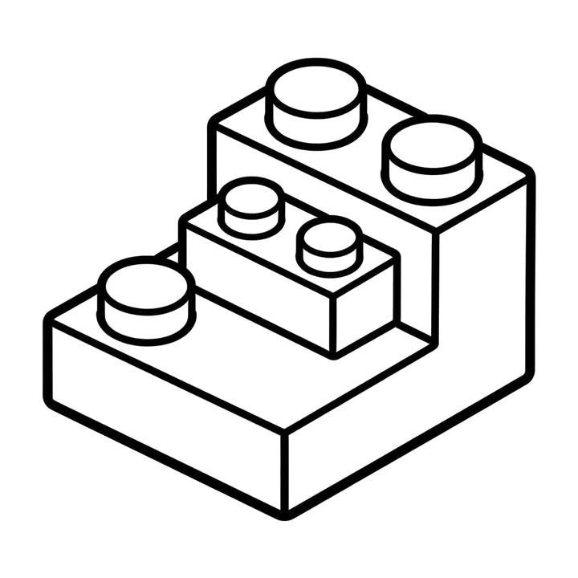
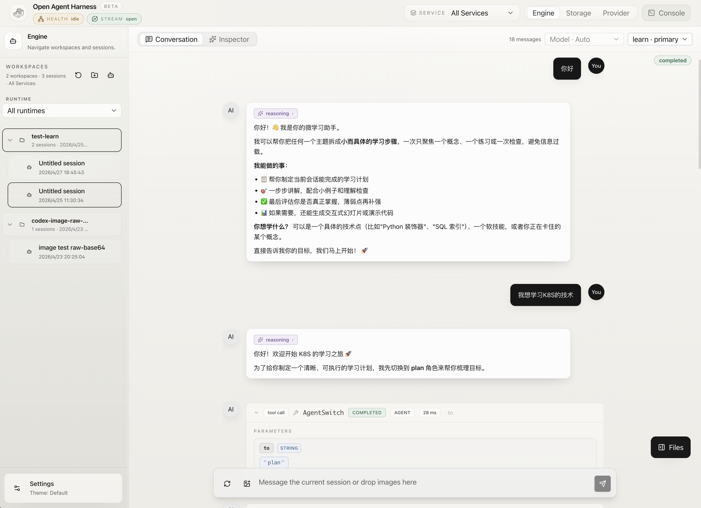
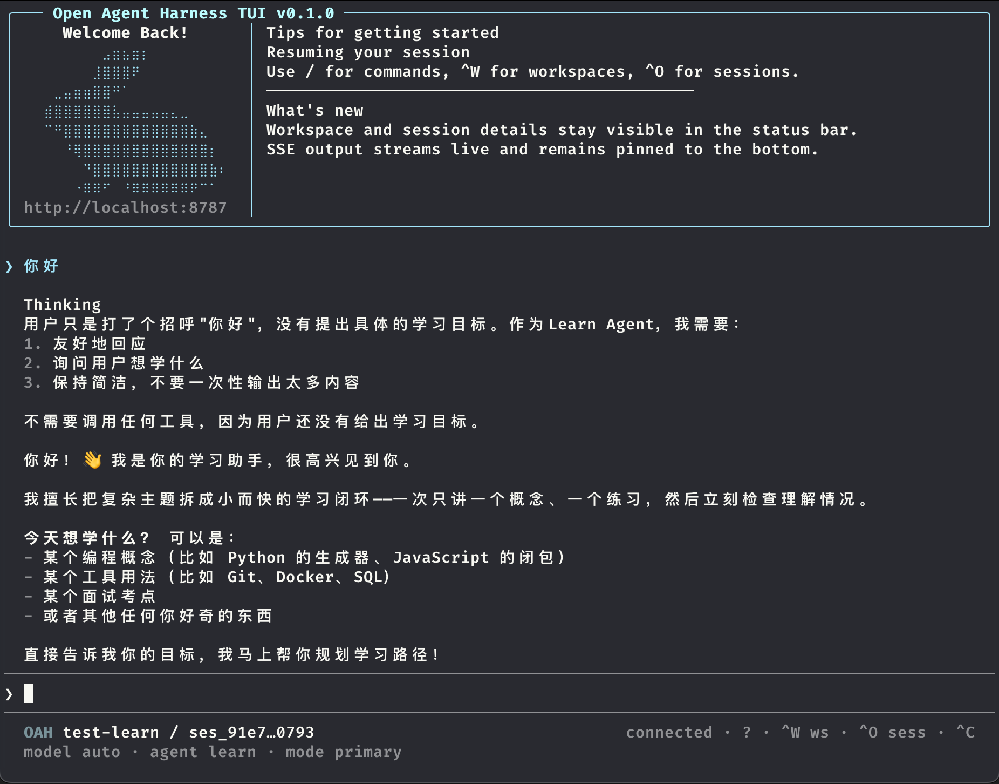

<p align="center">
  <picture>
    <source media="(prefers-color-scheme: dark)" srcset="assets/logo-readme-dark.png" />
    
  </picture>
</p>

<h1 align="center">Open Agent Harness</h1>

<p align="center">
  A headless, workspace-first agent engine for teams building internal AI platforms, agent products, and embedded copilots.
</p>

<p align="center">
  <a href="./README.zh-CN.md">中文版本</a> · <a href="./docs/getting-started.en.md">Getting Started</a> · <a href="./docs/README.md">Documentation</a>
</p>

---

## What It Is

Open Agent Harness (OAH) is the backend runtime layer for agent systems.

You bring your own product surface: chat UI, auth, tenant model, product workflow, and business logic. OAH provides the execution engine underneath:

- workspace loading and capability discovery
- session and run orchestration
- model/tool loop execution
- sandbox and file/command surfaces
- queueing, streaming, recovery, and auditability
- local and split deployment topologies

It is not a ready-made SaaS app or a polished end-user chat product.
It is the programmable engine you can build those products on top of.

## Current Status

The repository is no longer just an architecture sketch. Today it already includes:

- A working HTTP API for workspaces, sessions, runs, actions, sandboxes, models, storage inspection, and SSE streaming
- A multi-process topology with `oah-api`, `oah-controller`, and sandbox-hosted standalone workers
- A debug web console for conversation flow, trace inspection, and storage troubleshooting
- A terminal TUI for workspace selection, session chat, streaming output, and local runtime debugging
- Workspace auto-discovery for agents, models, skills, tools, actions, hooks, prompts, and project instructions
- A deploy-root template with starter runtimes and object-storage sync flow
- Local Docker Compose startup and a Kubernetes/Helm split-deployment skeleton

If you want to evaluate OAH as an engine foundation, there is enough here today to run it, inspect it, and extend it.

## What You Can Build With It

OAH is a good fit when you need one reusable agent backend that can power different projects or teams:

- Internal engineering copilots with repo-specific agents and tools
- Multi-agent products where different agents share one runtime substrate
- Embedded copilots behind an existing product UX
- Dedicated single-workspace backends for one repo or one tenant
- Platform teams that want a controllable runtime, not just a chat wrapper

## Core Model

Four concepts organize the system:

| Concept | Boundary | Meaning |
| --- | --- | --- |
| `sandbox` | Execution host boundary | Defines the host environment that carries workspace and where file/command execution actually happens |
| `workspace` | Capability boundary | Declares agents, models, skills, tools, actions, hooks, and prompts inside that execution environment |
| `session` | Context boundary | A continuous conversation or collaboration thread within one workspace |
| `run` | Execution boundary | One queued execution pass through the model/tool loop |

That gives OAH a simple operating model:

- sandboxes define where execution is hosted
- workspaces define what an agent system can do inside that host boundary
- sessions define ongoing context
- runs execute serially within a session

## What Already Works

### Runtime and API

- Workspace CRUD plus runtime/blueprint import and catalog inspection
- Session creation, paged message history, and async message enqueue
- Run lookup, step-level audit records, cancellation, queued-run `guide`, and manual `requeue`
- Manual session compaction with persisted `compact_boundary` and `compact_summary` artifacts
- SSE event streaming for run and session updates
- Sandbox-compatible file and command APIs rooted at `/workspace`

### Workspace Capability System

OAH already understands a workspace as a composable capability bundle:

- `AGENTS.md` project instructions
- `.openharness/agents/*.md`
- `.openharness/models/*.yaml`
- `.openharness/actions/*/ACTION.yaml`
- `.openharness/skills/*/SKILL.md`
- `.openharness/tools/settings.yaml` plus local/remote MCP servers
- `.openharness/hooks/*.yaml`
- `.openharness/prompts.yaml` and `.openharness/settings.yaml`

This makes the workspace the real customization boundary instead of global process config.

### Operations and Debugging

- Debug web console with streaming conversation view
- Server-side follow-up queue surfaced in the UI, plus explicit `Guide` interruption flow
- Inspector panels for messages, run steps, system prompt, provider calls, catalog snapshots, and records
- Storage workbench for PostgreSQL and Redis, including `messages.content` inspection and manual queue/recovery operations
- Health/readiness endpoints and controller metrics/snapshot surfaces
- Debug TUI for terminal-first workspace/session inspection and streaming conversations

## Web Console

The repository ships with a debug web console for development and inspection:

<p align="center">
  
</p>

It is intentionally built for runtime visibility, not just chatting:

- conversation streaming and run tracking
- queued follow-up messages above the composer
- run-step and tool-call inspection
- raw message / run / session record views
- storage debugging for PostgreSQL and Redis

## Debug TUI

For terminal-first development, OAH also ships an Ink-based debug TUI:

<p align="center">
  
</p>

The TUI talks to the same API and SSE surfaces as the web console. It is useful when you are already working inside a repository or shell and want to select a workspace, create or resume a session, stream assistant output, and inspect local run state without opening the browser.

```bash
pnpm dev:cli -- --base-url http://127.0.0.1:8787 tui
```

## Architecture At A Glance

| Layer | Responsibility |
| --- | --- |
| API server | OpenAPI ingress, validation, caller context, SSE, routing |
| Session/run orchestration | Per-session serial scheduling, cancellation, timeout, recovery |
| Context engine | Prompt assembly, agent/model resolution, capability exposure |
| LLM loop + dispatch | Model calls, tool calls, agent switching, subagent delegation |
| Worker execution | Active workspace copy, file access, command execution, sandbox lifecycle |
| Control plane | Placement signals, worker lifecycle, scaling and ownership governance |
| Storage | PostgreSQL truth, Redis queues/locks/fanout, local runtime state |

Production direction is the explicit split topology:

- `oah-api` for ingress and orchestration
- `oah-controller` for control-plane logic
- standalone workers hosted in `oah-sandbox` or a compatible sandbox backend

## Repository Layout

```text
apps/
  server/       # API server, worker entry, bootstrap, HTTP routes
  controller/   # control-plane process
  worker/       # worker package wrapper
  web/          # debug console
  cli/          # CLI entry
packages/
  engine-core/      # runtime orchestration and native tool layer
  api-contracts/    # zod schemas and shared API types
  model-runtime/    # model provider abstraction
  storage-*         # postgres / redis / sqlite / memory backends
  config/           # workspace and server config loading
template/
  deploy-root/      # starter OAH_DEPLOY_ROOT with runtimes/models/tools/skills layout
docs/
  ...               # architecture, workspace, engine, deploy, OpenAPI docs
```

## Quick Start

### Prerequisites

- Node.js `24+`
- `pnpm` `10+`
- Docker + Docker Compose

### 1. Install dependencies

```bash
pnpm install
```

### 2. Prepare a deploy root

```bash
mkdir -p /absolute/path/to/oah-deploy-root
cp -R ./template/deploy-root/. /absolute/path/to/oah-deploy-root
export OAH_DEPLOY_ROOT=/absolute/path/to/oah-deploy-root
```

Then add at least one platform model YAML under:

```text
$OAH_DEPLOY_ROOT/source/models/
```

For the bundled starter runtimes, the expected default model name is:

```text
openai-default
```

### 3. Start the local stack

```bash
pnpm local:up
```

This starts:

- PostgreSQL
- Redis
- MinIO
- `oah-api`
- `oah-controller`
- `oah-compose-scaler`
- `oah-sandbox`

The startup flow also runs one storage sync automatically. In the local split topology, `oah-api` does not persist active workspace copies; writable workspace state lives in `oah-sandbox` and flushes through the object-storage backing store.

### 4. Start the web console

```bash
pnpm dev:web
```

Or start the terminal TUI:

```bash
pnpm dev:cli -- --base-url http://127.0.0.1:8787 tui
```

Default local addresses and debug commands:

| Service | URL / Command |
| --- | --- |
| Web Console | `http://localhost:5174` |
| Debug TUI | `pnpm dev:cli -- --base-url http://127.0.0.1:8787 tui` |
| API | `http://127.0.0.1:8787` |
| Sandbox worker host | `http://127.0.0.1:8788` |
| Controller metrics | `http://127.0.0.1:8789` |
| MinIO Console | `http://127.0.0.1:9001` |

## Other Ways To Run It

### Single Workspace Mode

Use one repo directly, without the managed multi-workspace path:

```bash
pnpm exec tsx --tsconfig ./apps/server/tsconfig.json ./apps/server/src/index.ts -- \
  --workspace /absolute/path/to/workspace \
  --model-dir /absolute/path/to/models \
  --default-model openai-default
```

### Split Processes

For production or production-like setups, run:

- `oah-api` as API ingress
- `oah-controller` as control plane
- standalone workers inside `oah-sandbox`

The repo already ships:

- `docker-compose.local.yml`
- Kubernetes manifests under `deploy/kubernetes/`
- a Helm chart under `deploy/charts/open-agent-harness/`
- a production `Dockerfile`
- a GitHub Actions image publishing workflow

## Starter Runtime Templates

The deploy-root template includes two starter runtimes:

- `micro-learning`
  - short teaching loop with `learn`, `plan`, `eval`, and `research` agents
- `vibe-coding`
  - coding-oriented runtime with `build`, `plan`, `general`, and `explore` agents

These are initialization templates for new workspaces, not the active runtime copy itself.

## Common Commands

```bash
pnpm build
pnpm test
pnpm dev:web
pnpm dev:cli -- --base-url http://127.0.0.1:8787 tui
OAH_DEPLOY_ROOT=/absolute/path/to/oah-deploy-root pnpm storage:sync
OAH_DEPLOY_ROOT=/absolute/path/to/oah-deploy-root pnpm storage:sync -- --include-workspaces
OAH_DEPLOY_ROOT=/absolute/path/to/oah-deploy-root pnpm local:up
OAH_DEPLOY_ROOT=/absolute/path/to/oah-deploy-root OAH_SKIP_BUILD=1 OAH_LOCAL_SYNC_ON_CHANGE_ONLY=1 pnpm local:up
pnpm local:down
```

## Documentation Map

| Document | Description |
| --- | --- |
| [Getting Started](./docs/getting-started.en.md) | Local startup and first verification |
| [Architecture Overview](./docs/architecture-overview.en.md) | System boundaries and major layers |
| [Workspace Guide](./docs/workspace/README.en.md) | Workspace structure and capability discovery |
| [Engine Overview](./docs/engine/README.en.md) | Runtime lifecycle, context engine, and execution flow |
| [API Reference](./docs/openapi/README.en.md) | REST + SSE interface docs |
| [Deploy and Run](./docs/deploy.en.md) | Local, split, and Kubernetes deployment paths |
| [Deploy Root Template](./template/deploy-root/README.md) | Starter `OAH_DEPLOY_ROOT` layout |

## Future Vision

The long-term goal is to make OAH a solid open runtime kernel for serious agent systems, not a demo stack.

The direction we are already moving toward:

- A stable agent-engine backend that can sit behind many different product surfaces
- Stronger control-plane behavior for placement, warm capacity, recovery, and draining
- A clearer sandbox-host abstraction so self-hosted sandboxes and E2B-like backends can share one contract
- Better workspace packaging and capability distribution around runtimes, skills, tools, and models
- More first-class operational semantics for compaction, recovery, action execution, and audit trails

That vision matters because the hard part of agent products is rarely the chat box. It is the runtime discipline underneath: execution boundaries, repeatability, traceability, workspace isolation, and operational control. OAH is being shaped to solve that layer well.

## Who It Is For

**Good fit**

- Teams building internal AI platforms or embedded copilots
- Products that want to keep their own frontend and auth stack
- Engineering teams that need workspace isolation and inspectable execution
- Platform teams that want to evolve from single-node local agents to split deployments

**Probably not the best fit**

- You only want a ready-made chat UI
- You need a tiny local script and nothing more
- You do not need workspace boundaries, queueing, or runtime lifecycle management
