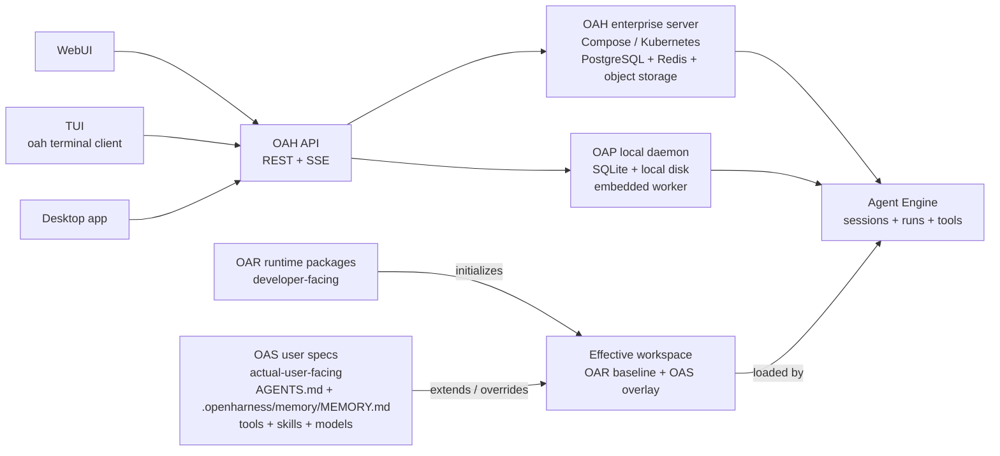

<p align="center">
  <picture>
    <source media="(prefers-color-scheme: dark)" srcset="assets/logo-readme-dark.png" />
    
  </picture>
</p>

<h1 align="center">Open Agent Harness</h1>

<p align="center">
  A headless, workspace-first agent engine for teams building internal AI platforms, agent products, and embedded copilots.
</p>

<p align="center">
  <a href="./README.zh-CN.md">中文版本</a> · <a href="./docs/getting-started.en.md">Getting Started</a> · <a href="./docs/README.md">Documentation</a>
</p>

---

## What It Is

Open Agent Harness (OAH) is the backend runtime layer for agent systems.

You bring your own product surface: chat UI, auth, tenant model, product workflow, and business logic. OAH provides the execution engine underneath:

- workspace loading and capability discovery
- session and run orchestration
- model/tool loop execution
- sandbox and file/command surfaces
- queueing, streaming, recovery, and auditability
- local and split deployment topologies

It is not a ready-made SaaS app or a polished end-user chat product.
It is the programmable engine you can build those products on top of.

## Current Status

The repository is no longer just an architecture sketch. Today it already includes:

- A working HTTP API for workspaces, sessions, runs, actions, sandboxes, models, storage inspection, and SSE streaming
- A multi-process topology with `oah-api`, `oah-controller`, and sandbox-hosted standalone workers
- A WebUI for sessions, runtime state, storage inspection, and system visibility
- A TUI for workspace selection, session chat, streaming output, and terminal workflows
- Workspace auto-discovery for agents, models, skills, tools, actions, hooks, prompts, and project instructions
- A deploy-root template with starter runtimes and object-storage sync flow
- Local Docker Compose startup and a Kubernetes/Helm split-deployment skeleton

If you want to evaluate OAH as an engine foundation, there is enough here today to run it, inspect it, and extend it.

## What You Can Build With It

OAH is a good fit when you need one reusable agent backend that can power different projects or teams:

- Internal engineering copilots with repo-specific agents and tools
- Multi-agent products where different agents share one runtime substrate
- Embedded copilots behind an existing product UX
- Dedicated single-workspace backends for one repo or one tenant
- Platform teams that want a controllable runtime, not just a chat wrapper

## Architecture and Deployment Shapes

OAH is designed as an infrastructure-style stack with four layers:

| Layer | Audience | Name | Role |
| --- | --- | --- | --- |
| `OAR` | Developer layer | Open Agent Runtime | Reusable runtime bundles that platform/runtime developers build and publish to initialize workspaces. |
| `OAS` | User layer | Open Agent Spec | User-imported tools, skills, model entries, `AGENTS.md`, `.openharness/memory/MEMORY.md`, and other workspace-level additions layered on top of an OAR/runtime baseline. |
| `OAH` | Service layer | Open Agent Harness | Enterprise/platform service deployment: Compose or Kubernetes, PostgreSQL, Redis, object storage, controller, sandbox fleet, and multiple workers. |
| `OAP` | Service layer | Open Agent Harness Personal | Personal service deployment: local daemon, SQLite, local disk, embedded worker, and single-user workflows. |

WebUI, TUI, and Desktop all connect to the same OAH-compatible API. They should work against either an enterprise server or a local personal daemon. Desktop is not OAP-specific; local daemon supervision is an extra capability only when it connects to OAP.



That means OAH and OAP differ by deployment profile, storage backend, worker/sandbox shape, and default directories, not by client protocol.
It also keeps authorship clear: developers publish OAR runtimes; actual users bring OAS specs that extend a runtime-backed workspace.
Clients should read a server profile, such as `GET /api/v1/system/profile`, before enabling enterprise-only or personal/local-only behavior.

## Core Model

Four concepts organize the system:

| Concept | Boundary | Meaning |
| --- | --- | --- |
| `sandbox` | Execution host boundary | Defines the host environment that carries workspace and where file/command execution actually happens |
| `workspace` | Capability boundary | Declares agents, models, skills, tools, actions, hooks, and prompts inside that execution environment |
| `session` | Context boundary | A continuous conversation or collaboration thread within one workspace |
| `run` | Execution boundary | One queued execution pass through the model/tool loop |

That gives OAH a simple operating model:

- sandboxes define where execution is hosted
- workspaces define what an agent system can do inside that host boundary
- sessions define ongoing context
- runs execute serially within a session

## What Already Works

### Runtime and API

- Workspace CRUD plus runtime/blueprint import and catalog inspection
- Session creation, paged message history, and async message enqueue
- Run lookup, step-level audit records, cancellation, queued-run `guide`, and manual `requeue`
- Manual session compaction with persisted `compact_boundary` and `compact_summary` artifacts
- SSE event streaming for run and session updates
- Sandbox-compatible file and command APIs rooted at `/workspace`

### Workspace Capability System

OAH already understands a workspace as a composable capability bundle:

- `AGENTS.md` project instructions
- `.openharness/agents/*.md`
- `.openharness/models/*.yaml`
- `.openharness/actions/*/ACTION.yaml`
- `.openharness/skills/*/SKILL.md`
- `.openharness/tools/settings.yaml` plus local/remote MCP servers
- `.openharness/hooks/*.yaml`
- `.openharness/prompts.yaml` and `.openharness/settings.yaml`

This makes the workspace the real customization boundary instead of global process config.

### Clients and Operations

- WebUI with streaming conversation view
- Server-side follow-up queue surfaced in the UI, plus explicit `Guide` interruption flow
- Inspector panels for messages, run steps, system prompt, provider calls, catalog snapshots, and records
- Storage workbench for PostgreSQL and Redis, including `messages.content` inspection and manual queue/recovery operations
- Health/readiness endpoints and controller metrics/snapshot surfaces
- TUI for terminal-first workspace/session inspection and streaming conversations

## WebUI

The repository ships with a WebUI for sessions, runtime state, storage inspection, and system visibility:

<p align="center">
  
</p>

It is intentionally built for runtime visibility, not just chatting:

- conversation streaming and run tracking
- queued follow-up messages above the composer
- run-step and tool-call inspection
- raw message / run / session record views
- storage inspection for PostgreSQL and Redis

## TUI

For terminal-first work, OAH also ships an Ink-based TUI:

<p align="center">
  
</p>

The TUI talks to the same API and SSE surfaces as the WebUI. It is useful when you are already working inside a repository or shell and want to select a workspace, create or resume a session, and stream assistant output without opening the browser.

```bash
pnpm dev:cli -- tui
```

## Desktop

Desktop is the planned desktop client shape, not an OAP-only product. It should connect to the same OAH-compatible API as WebUI and TUI, show whether the current endpoint is OAH or OAP from the server profile, and only enable local daemon supervision when the connected server advertises that capability.

The current desktop baseline is a thin Electron shell around the existing WebUI. It does not embed the daemon or engine; by default it starts or reuses the local OAP daemon and injects that API endpoint into the WebUI settings.

```bash
pnpm dev:desktop
```

## Architecture At A Glance

| Layer | Responsibility |
| --- | --- |
| API server | OpenAPI ingress, validation, caller context, SSE, routing |
| Session/run orchestration | Per-session serial scheduling, cancellation, timeout, recovery |
| Context engine | Prompt assembly, agent/model resolution, capability exposure |
| LLM loop + dispatch | Model calls, tool calls, agent switching, subagent delegation |
| Worker execution | Active workspace copy, file access, command execution, sandbox lifecycle |
| Control plane | Placement signals, worker lifecycle, scaling and ownership governance |
| Storage | PostgreSQL truth, Redis queues/locks/fanout, local runtime state |

Production direction is the explicit split topology:

- `oah-api` for ingress and orchestration
- `oah-controller` for control-plane logic
- standalone workers hosted in `oah-sandbox` or a compatible sandbox backend

## Repository Layout

```text
apps/
  server/       # API server, worker entry, bootstrap, HTTP routes
  controller/   # control-plane process
  worker/       # worker package wrapper
  web/          # WebUI
  desktop/      # Electron shell around WebUI
  cli/          # TUI and terminal command entry
packages/
  engine-core/      # runtime orchestration and native tool layer
  api-contracts/    # zod schemas and shared API types
  model-runtime/    # model provider abstraction
  storage-*         # postgres / redis / sqlite / memory backends
  config/           # workspace and server config loading
template/
  deploy-root/      # starter OAH_DEPLOY_ROOT with runtimes/models/tools/skills layout
docs/
  ...               # architecture, workspace, engine, deploy, OpenAPI docs
```

## Quick Start

Choose a deployment shape first:

- **OAP personal daemon**: local single-user use, SQLite, local disk, embedded worker.
- **OAH enterprise/split stack**: team or platform use, PostgreSQL, Redis, object storage, controller, sandbox workers, Compose or Kubernetes.

### Prerequisites

- Node.js `24+`
- `pnpm` `10+`
- Docker + Docker Compose for the OAH split stack
- Helm and `kubectl` for Kubernetes deployments

### Personal local daemon (OAP)

The packaged daemon command is the intended product shape:

```bash
oah daemon init
oah daemon start
oah daemon status
cd /path/to/repo
oah tui
oah tui --runtime vibe-coding
```

The CLI package carries the OAP deploy-root assets used by `oah daemon init` and starts the daemon through the packaged server entrypoint when a source checkout is not present. In a monorepo checkout, the same commands prefer local source/dist paths so development and packaged installs follow the same lifecycle.

In this repository, the development equivalent is:

```bash
pnpm install
pnpm dev:cli -- daemon init
pnpm dev:cli -- daemon start
pnpm dev:cli -- daemon status
pnpm dev:cli -- daemon state
pnpm dev:cli -- daemon maintenance --dry-run
```

`daemon state` summarizes `OAH_HOME/state` disk usage, including shadow SQLite history databases. `daemon maintenance` checkpoints and vacuums local shadow SQLite databases; it refuses to run while the daemon process appears active unless `--force` is supplied.

Manage local OAP assets under `OAH_HOME`:

```bash
pnpm dev:cli -- models list
pnpm dev:cli -- models add ./model.yaml
pnpm dev:cli -- models default openai-default
pnpm dev:cli -- runtimes list
pnpm dev:cli -- tools list
pnpm dev:cli -- tools enable docs-search
pnpm dev:cli -- skills list
pnpm dev:cli -- skills enable summarize
pnpm dev:cli -- workspace:list --missing
pnpm dev:cli -- workspace repair <workspace-id> --workspace /new/path/to/repo
pnpm dev:cli -- workspace migrate-history --workspace /path/to/repo --dry-run
```

`models default` updates only `OAH_HOME/config/daemon.yaml`. `tools list` and `skills list` read the global catalog under `OAH_HOME`; `tools enable <name>` and `skills enable <name>` copy or write the selected asset into the current repo's `.openharness` directory. Use `--workspace /path/to/repo` to target another repo, `--dry-run` to preview writes, and `--overwrite` to replace an existing workspace asset.

If a repo is moved or renamed, use `workspace:list --missing` to find stale local records, then `workspace repair <workspace-id> --workspace /new/path/to/repo` to rebind the existing record. Repair keeps the old workspace id so OAP shadow history, sessions, runs, and messages stay attached; the repaired record updates `externalRef` to `local:path:<resolved-path>`.

For early repo-local history, `workspace migrate-history` copies `repo/.openharness/data/history.db` into OAP shadow storage at `OAH_HOME/state/data/workspace-state/<workspace-id>/history.db`. The source database is never deleted; use `--dry-run` to preview, and `--overwrite` to replace an existing shadow database after backing it up.

Then connect a client to the local daemon:

```bash
cd /path/to/repo
pnpm dev:cli -- tui
pnpm dev:cli -- tui --runtime vibe-coding
pnpm dev:cli -- web
```

When no `--base-url` is provided, `oah tui` treats the current directory as the local workspace and registers or reuses it through the OAP daemon. `--runtime <name>` only bootstraps the repo when `.openharness/` is absent; existing OAS config is left untouched. After opening the workspace, TUI resumes the latest session by default, creates one if none exists, and accepts `--new-session` / `--resume-last` for explicit startup behavior.

`oah web` serves the built WebUI bundle when available and falls back to the Vite dev server in a source checkout. In both modes it points the WebUI at the same OAH-compatible API endpoint and forwards the local daemon bearer token when needed.

Daemon state is kept under `OAH_HOME` (default `~/.openagentharness`): `config/daemon.yaml`, `run/daemon.pid`, `run/token`, and `logs/daemon.log`. The local daemon uses `run/token` as its bearer token for non-public API routes; CLI/TUI, `oah web`, and Desktop read or forward it automatically.

### Enterprise local stack (OAH)

Use this path when you want the split service topology locally with PostgreSQL, Redis, MinIO, controller, and sandbox workers.

#### 1. Install dependencies

```bash
pnpm install
```

#### 2. Prepare a deploy root

```bash
mkdir -p /absolute/path/to/oah-deploy-root
cp -R ./template/deploy-root/. /absolute/path/to/oah-deploy-root
export OAH_DEPLOY_ROOT=/absolute/path/to/oah-deploy-root
```

Then add at least one platform model YAML under:

```text
$OAH_DEPLOY_ROOT/models/
```

For the bundled starter runtimes, the expected default model name is:

```text
openai-default
```

#### 3. Start the local stack

```bash
pnpm local:up
```

This starts:

- PostgreSQL
- Redis
- MinIO
- `oah-api`
- `oah-controller`
- `oah-compose-scaler`
- `oah-sandbox`

The startup flow also runs one storage sync automatically. In the local split topology, `oah-api` does not persist active workspace copies; writable workspace state lives in `oah-sandbox` and flushes through the object-storage backing store.

#### 4. Start the WebUI

```bash
pnpm dev:web
```

Or start the terminal TUI:

```bash
pnpm dev:cli -- --base-url http://127.0.0.1:8787 tui
```

Default local addresses and client commands:

| Service | URL / Command |
| --- | --- |
| WebUI | `http://localhost:5173` |
| TUI | `pnpm dev:cli -- --base-url http://127.0.0.1:8787 tui` |
| API | `http://127.0.0.1:8787` |
| Sandbox worker host | `http://127.0.0.1:8788` |
| Controller metrics | `http://127.0.0.1:8789` |
| MinIO Console | `http://127.0.0.1:9001` |

## Other Ways To Run It

### Kubernetes / Helm

For a cluster deployment, use the deploy-root Kubernetes profile as the source of the Helm `server.yaml`:

```bash
export OAH_DEPLOY_ROOT=/absolute/path/to/oah-deploy-root

helm upgrade --install oah ./deploy/charts/open-agent-harness \
  --namespace open-agent-harness \
  --create-namespace \
  --set-file config.serverYaml="$OAH_DEPLOY_ROOT/config/kubernetes.server.yaml"
```

See [Deploy and Run](./docs/deploy.en.md) for production values, credentials, persistence, and hardening.

### Legacy Single Workspace Mode

Single workspace server mode is now a compatibility path for old scripts and focused internal tests. For normal personal use, prefer the OAP daemon plus `oah tui` from inside the repo.
Starting the server with `--workspace` prints a deprecation warning so new users do not mistake this path for the OAP product shape.

```bash
pnpm exec tsx --tsconfig ./apps/server/tsconfig.json ./apps/server/src/index.ts -- \
  --workspace /absolute/path/to/workspace \
  --model-dir /absolute/path/to/models \
  --default-model openai-default
```

### Split Processes

For production or production-like setups, run:

- `oah-api` as API ingress
- `oah-controller` as control plane
- standalone workers inside `oah-sandbox`

The repo already ships:

- `docker-compose.local.yml`
- Kubernetes manifests under `deploy/kubernetes/`
- a Helm chart under `deploy/charts/open-agent-harness/`
- a production `Dockerfile`
- a GitHub Actions image publishing workflow

## Starter Runtime Templates

The deploy-root template includes two starter runtimes:

- `micro-learning`
  - short teaching loop with `learn`, `plan`, `eval`, and `research` agents
- `vibe-coding`
  - coding-oriented runtime with `build`, `plan`, `general`, and `explore` agents

These are initialization templates for new workspaces, not the active runtime copy itself.

## Common Commands

```bash
pnpm build
pnpm test
pnpm exec tsx --tsconfig ./apps/server/tsconfig.json ./apps/server/src/index.ts -- --config "$HOME/.openagentharness/config/daemon.yaml"
pnpm dev:cli -- web
pnpm dev:cli -- tui --workspace .
pnpm dev:desktop
OAH_DEPLOY_ROOT=/absolute/path/to/oah-deploy-root pnpm storage:sync
OAH_DEPLOY_ROOT=/absolute/path/to/oah-deploy-root pnpm storage:sync -- --include-workspaces
OAH_DEPLOY_ROOT=/absolute/path/to/oah-deploy-root pnpm local:up
OAH_DEPLOY_ROOT=/absolute/path/to/oah-deploy-root OAH_SKIP_BUILD=1 OAH_LOCAL_SYNC_ON_CHANGE_ONLY=1 pnpm local:up
pnpm local:down
helm upgrade --install oah ./deploy/charts/open-agent-harness --namespace open-agent-harness --create-namespace --set-file config.serverYaml=/absolute/path/to/oah-deploy-root/config/kubernetes.server.yaml
```

## Documentation Map

| Document | Description |
| --- | --- |
| [Getting Started](./docs/getting-started.en.md) | Local startup and first verification |
| [Architecture Overview](./docs/architecture-overview.en.md) | System boundaries and major layers |
| [Workspace Guide](./docs/workspace/README.en.md) | Workspace structure and capability discovery |
| [Engine Overview](./docs/engine/README.en.md) | Runtime lifecycle, context engine, and execution flow |
| [API Reference](./docs/openapi/README.en.md) | REST + SSE interface docs |
| [Deploy and Run](./docs/deploy.en.md) | Local, split, and Kubernetes deployment paths |
| [Home and Deploy Root](./docs/home-and-deploy-root.md) | `OAH_HOME`, `OAH_DEPLOY_ROOT`, local daemon, and deployment profiles |
| [Deploy Root Template](./template/deploy-root/README.md) | Starter `OAH_DEPLOY_ROOT` layout |

## Future Vision

The long-term goal is to make OAH a solid open runtime kernel for serious agent systems, not a demo stack.

The direction we are already moving toward:

- A stable agent-engine backend that can sit behind many different product surfaces
- Stronger control-plane behavior for placement, warm capacity, recovery, and draining
- A clearer sandbox-host abstraction so self-hosted sandboxes and E2B-like backends can share one contract
- Better workspace packaging and capability distribution around runtimes, skills, tools, and models
- More first-class operational semantics for compaction, recovery, action execution, and audit trails

That vision matters because the hard part of agent products is rarely the chat box. It is the runtime discipline underneath: execution boundaries, repeatability, traceability, workspace isolation, and operational control. OAH is being shaped to solve that layer well.

## Who It Is For

**Good fit**

- Teams building internal AI platforms or embedded copilots
- Products that want to keep their own frontend and auth stack
- Engineering teams that need workspace isolation and inspectable execution
- Platform teams that want to evolve from single-node local agents to split deployments

**Probably not the best fit**

- You only want a ready-made chat UI
- You need a tiny local script and nothing more
- You do not need workspace boundaries, queueing, or runtime lifecycle management
