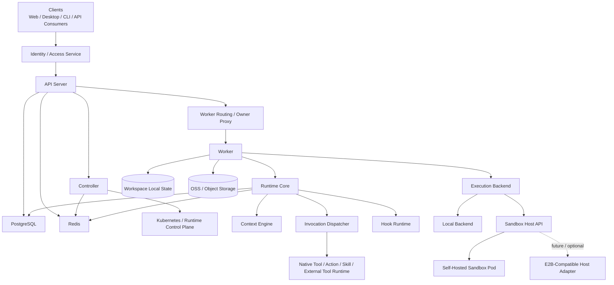
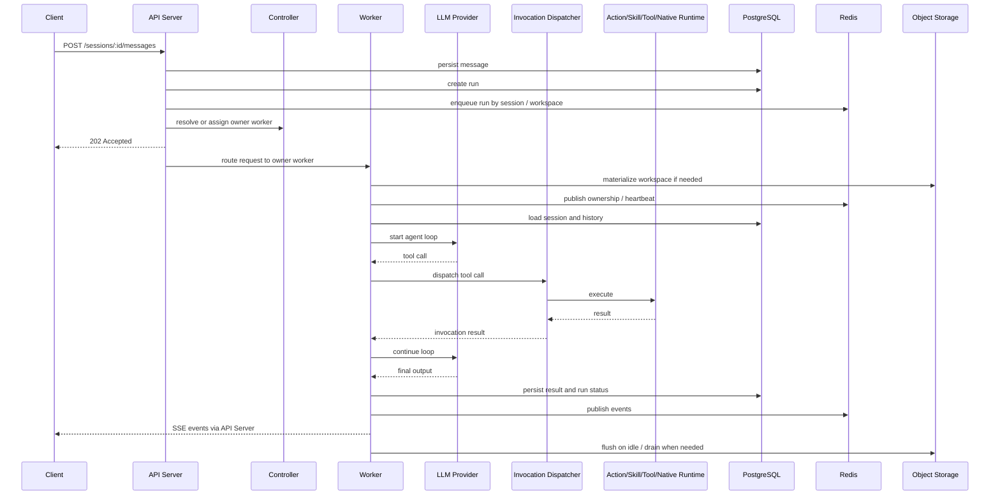

# Architecture Overview

## 1. What This Is

Open Agent Harness is a headless agent runtime. It has no UI -- it exposes capabilities through OpenAPI + SSE for web apps, desktop clients, CLIs, and automation systems.

Two types of users:

- **Platform developers** -- define agents, actions, skills, tools, hooks
- **Consumers** -- open a workspace and collaborate with agents to execute tasks

Two workspace kinds:

| Kind | Description |
|------|-------------|
| `project` | Full workspace with tools, execution, and local runtime state |
| `chat` | Read-only conversation workspace; loads only prompts / agents / models; no execution |

## 2. Design Principles

- **Workspace First** -- The platform provides the runtime; the workspace declares capabilities. All project-level capabilities live in the workspace, except model credentials.
- **Session Serial, System Parallel** -- Runs are serial within a session; sessions run concurrently; intra-run tool parallelism is agent-policy-controlled.
- **Domain Separate, Invocation Unified** -- action / skill / tool / native tool stay separate in domain, config, and governance; unified as tool calling for the LLM.
- **Local First, Sandbox Ready** -- Default local execution; execution layer is replaceable from day one; future support for containers / VMs / remote runners.
- **Identity Externalized** -- No built-in user system; consumes external identity and access context.
- **Auditable by Default** -- All runs, tool calls, action runs, and hook runs produce structured records.
- **Central Truth, Local Runtime State** -- PostgreSQL is the central source of truth; workspace `history.db` only stores local runtime data and is not a cross-process sync path.
- **Embedded by Default, Controlled in Production** -- Default single-process API + embedded worker; production uses a split `API Server + Worker + Controller` topology.

## 3. Formal Terms

### API Server

- The unified external entry point for OAH
- Owns OpenAPI, SSE, caller context, auth integration, metadata persistence, and owner routing
- Can run with an embedded worker or in `api-only` mode

### Worker

- The unified execution runtime role in OAH
- Owns run execution, session-serial boundaries, the tool loop, workspace file access, workspace materialization, and flush / evict
- `Worker` is a responsibility, not a deployment shape

### Controller

- The control-plane role in OAH
- Owns workspace placement, user affinity, capacity, drain, recovery, rebalance, and scaling
- `Controller` does not execute business runs directly

### Sandbox

- The isolated host environment where a worker runs
- May be a local process, a dedicated Pod, a container, or a future VM / remote executor
- `Sandbox` describes the execution environment; it does not replace `Worker` as the primary term

### Sandbox Host API

- The stable adapter boundary between the worker and its host environment
- The first implementation should be OAH's own sandbox pod
- Future implementations may be compatible with E2B-style remote sandbox providers
- It carries host lifecycle, file access, and process execution capabilities only; it does not redefine OAH ownership or control-plane semantics

### Workspace Ownership

- `workspace -> owner worker` is the routing truth for execution and file access
- `userId` is a scheduling affinity key, not an ownership truth key
- While active, a workspace's read/write truth lives in the owner worker's local copy; after idle flush, truth returns to OSS / external storage

## 4. Layered Architecture

## 5. Core Modules

### API Server

- Provides OpenAPI endpoints and SSE event streams
- Receives / validates caller context from upstream
- Handles access control, rate limiting, parameter validation, and metadata persistence
- Creates workspaces, sessions, messages, and runs
- Resolves workspace ownership and routes run / file requests to the owner worker
- Default mode includes an embedded worker; `api-only` mode handles ingress and routing only

### Worker

- Reuses `packages/runtime-core` for business execution logic
- Consumes runs and drives the model <-> tool loop
- Enforces per-session serial execution
- Manages cancellation, timeout, and failure recovery
- Owns workspace materialization, local file access, and flush / evict
- Can run embedded inside the API Server or standalone in a dedicated Pod

### Controller

- Owns workspace placement and worker lifecycle governance
- Combines `user affinity + workspace ownership + worker health + capacity` into placement decisions
- Owns drain, rebalance, recovery, and scaling
- Does not execute business runs directly

### Sandbox Host API

- Unifies the host capabilities a worker depends on
- It should cover only:
  - sandbox / session creation and reuse
  - workspace materialization / mount
  - file read / write / download
  - command execution / process management
  - health, drain, and shutdown
- The current target is "compatible switching" with E2B, not reshaping OAH around E2B's full native resource model first

### Runtime Core

- Loads workspace config: `AGENTS.md`, `settings.yaml`, agents, models
- Loads platform-level model / tool / skill directories
- Assembles system prompt, history messages, and capability catalog
- `project` workspace: loads all capability types
- `chat` workspace: loads agents / models / AGENTS.md only; tool catalog is empty
- Owns the run state machine, session-serial boundaries, tool loop, audit, and recovery closure

### Invocation Dispatcher

- Maps tool call names back to source (native / action / skill / external)
- Routes to the appropriate executor
- Wraps parameter parsing, audit, timeout, and result propagation

### Execution Backend

- Unified workspace execution environment (shell, file I/O, process management)
- Abstracts local execution, self-hosted sandbox pods, and future E2B-like host backends
- `chat` workspaces never create a backend session

### Hook Runtime

- Executes lifecycle hooks (run events) and interceptor hooks (tool / model events)
- Allows controlled modification of requests and execution logic within safety bounds

## 6. Recommended Deployment Modes

| Mode | Description |
|------|-------------|
| API + embedded worker | Default. Single-process, full execution. Uses Redis queue when configured, otherwise in-process. |
| API only + standalone worker + controller | Main production mode. API Server handles ingress and owner routing, Worker handles execution, Controller handles the control plane. |
| Standalone worker in sandbox | A worker deployment shape where the worker runs inside a dedicated worker Pod / sandbox Pod. |
| API only + controller + sandbox-hosted worker | Preferred evolution path. Use OAH's own sandbox pod first, then converge the host interface toward an E2B-compatible boundary. |

## 7. Request Flow

## 8. Key Architecture Decisions

- No built-in user system -- consumes external identity and access context
- Workspace is the configuration and capability discovery boundary; `.openharness/settings.yaml` is the entry point
- Platform built-in agents merge with workspace agents; workspace agents override on name collision
- Templates are for initialization only -- runtime reads current workspace files
- `chat_dir` subdirectories are directly usable workspaces, not templates
- `AGENTS.md` is injected verbatim (no summarization)
- Agents defined via `agents/*.md` -- frontmatter for config, body for system prompt
- Model / Hook / Tool Server configs use declarative YAML
- Actions use `actions/*/ACTION.yaml`; Skills use `skills/*/SKILL.md`
- All capabilities are unified as tool calling for the LLM, but stay separate in domain and governance
- `Worker` is the unified execution role; `sandbox` is only the worker host environment, not the primary runtime term
- `Sandbox Host API` is the host compatibility boundary; the first implementation should be the self-hosted sandbox pod, with E2B as a later pluggable backend rather than the primary architecture vocabulary
- `Controller` is the unified control-plane role; it owns placement, lifecycle, and capacity rather than direct business execution
- `workspace -> owner worker` is the routing truth for execution and file access; `userId` is used only for affinity scheduling, not as the ownership truth
- While active, a workspace's read/write truth lives in the owner worker's local copy; after flush / evict, truth returns to OSS / external storage
- Default trusted intranet environment -- no strong container isolation by default; if the platform is exposed more broadly, sandbox backend hardening should be prioritized
- PostgreSQL is the central source of truth; local workspace state files do not serve as a cross-process sync mechanism

## 9. Technology

| Layer | Choice |
|-------|--------|
| Language | TypeScript / Node.js |
| API | OpenAPI 3.1 + HTTP + SSE |
| Database | PostgreSQL |
| Queue & coordination | Redis |
| Local runtime data | SQLite |
| Model layer | Vercel AI SDK + dual-layer model registry |
