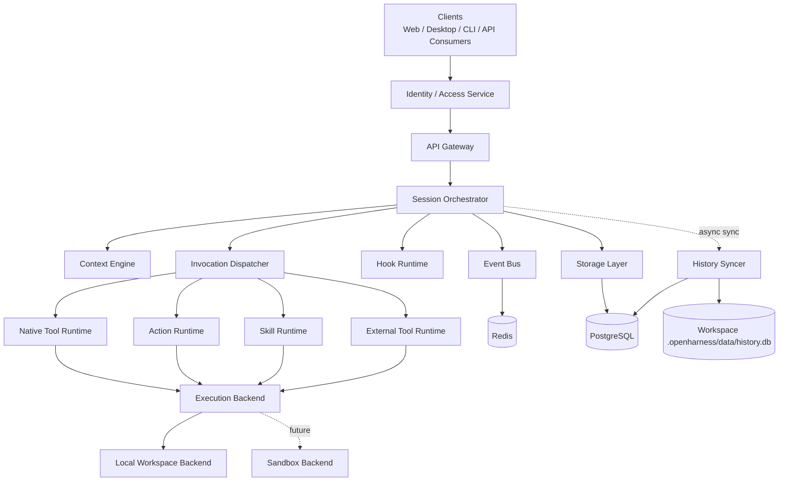
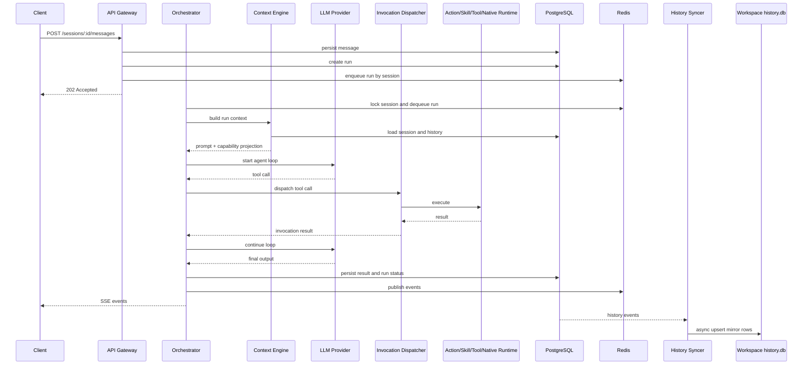

# Architecture Overview

## 1. What This Is

Open Agent Harness is a headless agent runtime. It has no UI -- it exposes capabilities through OpenAPI + SSE for web apps, desktop clients, CLIs, and automation systems.

Two types of users:

- **Platform developers** -- define agents, actions, skills, tools, hooks
- **Consumers** -- open a workspace and collaborate with agents to execute tasks

Two workspace kinds:

| Kind | Description |
|------|-------------|
| `project` | Full workspace with tools, execution, and local history mirror |
| `chat` | Read-only conversation workspace; loads only prompts / agents / models; no execution |

## 2. Design Principles

- **Workspace First** -- The platform provides the runtime; the workspace declares capabilities. All project-level capabilities live in the workspace, except model credentials.
- **Session Serial, System Parallel** -- Runs are serial within a session; sessions run concurrently; intra-run tool parallelism is agent-policy-controlled.
- **Domain Separate, Invocation Unified** -- action / skill / tool / native tool stay separate in domain, config, and governance; unified as tool calling for the LLM.
- **Local First, Sandbox Ready** -- Default local execution; execution layer is replaceable from day one; future support for containers / VMs / remote runners.
- **Identity Externalized** -- No built-in user system; consumes external identity and access context.
- **Auditable by Default** -- All runs, tool calls, action runs, and hook runs produce structured records.
- **Central Truth, Local Mirror** -- PostgreSQL is the source of truth; workspace `history.db` is async-only mirror, never in the online path.
- **Embedded by Default, Split in Production** -- Default single-process API + embedded worker; production supports API-only + standalone worker split.

## 3. Layered Architecture

## 4. Core Modules

### API Gateway

- Provides OpenAPI endpoints and SSE event streams
- Receives / validates caller context from upstream
- Handles access control, rate limiting, parameter validation
- Default mode includes embedded worker; `api-only` mode delegates to external workers

### Session Orchestrator

- Creates runs and enqueues them per session
- Enforces per-session serial execution
- Drives the model <-> tool loop
- Manages cancellation, timeout, failure recovery

### Context Engine

- Loads workspace config: `AGENTS.md`, `settings.yaml`, agents, models
- Loads platform-level model / tool / skill directories
- Assembles system prompt, history messages, and capability catalog
- `project` workspace: loads all capability types
- `chat` workspace: loads agents / models / AGENTS.md only; tool catalog is empty

### Invocation Dispatcher

- Maps tool call names back to source (native / action / skill / external)
- Routes to the appropriate executor
- Wraps parameter parsing, audit, timeout, and result propagation

### Execution Backend

- Unified workspace execution environment (shell, file I/O, process management)
- Abstracts local execution vs. future sandbox execution
- `chat` workspaces never create a backend session

### Hook Runtime

- Executes lifecycle hooks (run events) and interceptor hooks (tool / model events)
- Allows controlled modification of requests and execution logic within safety bounds

### History Syncer

- Consumes history events from PostgreSQL
- Async writes to workspace `history.db`
- Maintains sync cursor, retry, and rebuild logic
- Mirror failures never block the main request path
- Only active for `project` workspaces with mirror enabled

## 5. Process Modes

| Mode | Description |
|------|-------------|
| API + embedded worker | Default. Single-process, full execution. Uses Redis queue when configured, otherwise in-process. |
| API only | Interface-only; requires separate worker deployment. |
| Standalone worker | Consumes Redis queue independently. Handles run execution and history mirror sync. |

## 6. Request Flow

## 7. Key Architecture Decisions

- No built-in user system -- consumes external identity and access context
- Workspace is the configuration and capability discovery boundary; `.openharness/settings.yaml` is the entry point
- Platform built-in agents merge with workspace agents; workspace agents override on name collision
- Templates are for initialization only -- runtime reads current workspace files
- `chat_dir` subdirectories are directly usable workspaces, not templates
- `AGENTS.md` is injected verbatim (no summarization)
- Agents defined via `agents/*.md` -- frontmatter for config, body for system prompt
- Model / Hook / Tool Server configs use declarative YAML
- Actions use `actions/*/ACTION.yaml`; Skills use `skills/*/SKILL.md`
- All capabilities are unified as tool calling for the LLM, but stay separate in domain and governance
- Default trusted intranet environment -- no container isolation yet
- PostgreSQL is the source of truth; `history.db` is an async mirror only

## 8. Technology

| Layer | Choice |
|-------|--------|
| Language | TypeScript / Node.js |
| API | OpenAPI 3.1 + HTTP + SSE |
| Database | PostgreSQL |
| Queue & coordination | Redis |
| Local history mirror | SQLite |
| Model layer | Vercel AI SDK + dual-layer model registry |
