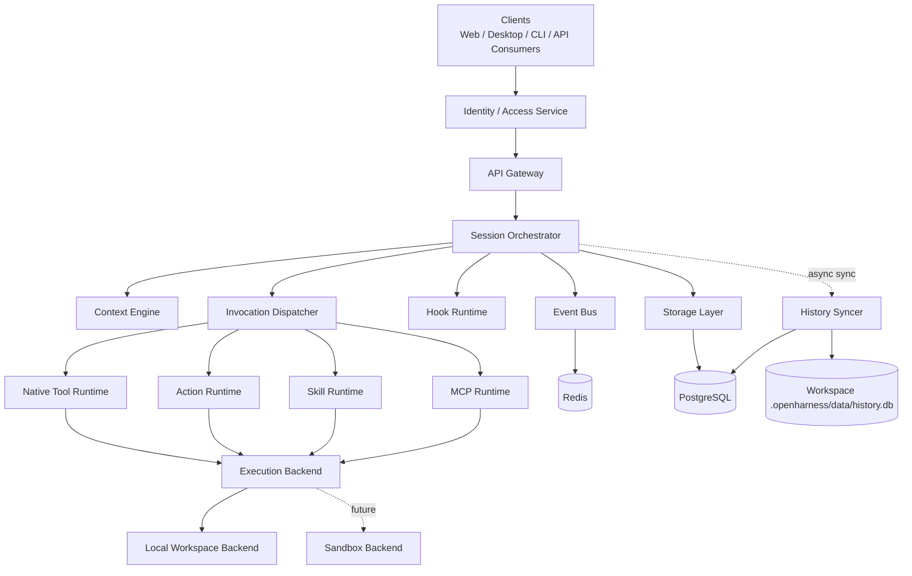
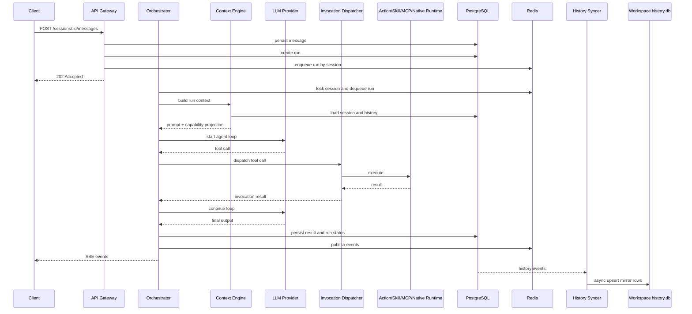

# Architecture Overview

## 1. 产品目标

Open Agent Harness 是一个纯服务端的 Agent Runtime。它不提供 UI，而是通过 OpenAPI 和 SSE 暴露能力，供桌面端、Web 客户端、CLI、自动化系统或其他服务接入。

为了开发和排障，系统可额外提供一个轻量 `oah` CLI / TUI 作为调试入口，但它属于调试工具层，不改变运行时本身的 headless 定位。

该系统要同时满足两类使用者：

- 平台开发者
  - 可以定义 Agent、Action、Skill、MCP、Hook
- 调用方
  - 打开某个 workspace 后即可与 Agent 协作，执行 shell、调用 MCP、使用 Skill 和 Action

系统中的 workspace 可以有两种运行形态：

- `project`
  - 常规项目 workspace，可启用工具、执行和本地历史镜像
- `chat`
  - 只读普通对话 workspace，用于承载不同对话模式，不允许修改目录内容，也不启用执行型能力

## 2. 设计原则

### 2.1 Workspace First

平台负责提供运行时，workspace 负责提供能力定义。除模型凭证外，项目级能力尽量都在 workspace 内声明。

平台也可提供一组内建 agent，作为打开 workspace 后即可直接使用的开箱即用能力。

### 2.2 Session Serial, System Parallel

- 同一个 `session` 内一次只允许一个 active run
- 不同 `session` 可并发执行
- 是否允许同一 `run` 内多个工具并发，由 agent 策略显式控制

### 2.3 Domain Separate, Invocation Unified

- `action`、`skill`、`mcp`、`native tool` 在领域层、配置层、治理层保持分离
- 与 LLM 对接时，统一投影为 tool calling 所需的 schema 和调用协议

### 2.4 Local First, Sandbox Ready

- 当前默认使用本地目录级执行
- 执行层接口从第一天开始抽象为可替换 backend
- 后续可接入容器、VM 或远程执行器
- `chat` workspace 不进入执行 backend

### 2.5 Identity Externalized

- 用户、组织、成员关系、认证鉴权不由本系统维护
- 运行时只消费来自上游网关或外部服务的身份与访问上下文
- 审计、限流、并发控制基于外部 `subject_ref` 等引用完成

### 2.6 Auditable by Default

所有 run、tool call、action run、hook run 都需要有结构化记录，便于追踪、回放和排障。

### 2.7 Central Truth, Local Mirror

- PostgreSQL 保存唯一事实数据
- workspace 可保留 `.openharness/data/history.db` 作为本地历史镜像
- 本地镜像只做异步备份与离线检视，不参与在线调度主路径

### 2.8 Embedded By Default, Split In Production

- `server` 默认应提供 `API + embedded worker` 的开箱即用体验
- 单机开发和小规模自托管场景下，只启动一个 `server` 进程即可完整执行 run
- 生产环境仍应支持 `API only + standalone worker` 的拆分部署方式
- Redis 用于队列和分布式协调，但不负责进程生命周期管理

## 3. 系统边界

### 3.1 系统内能力

- 多 workspace 管理
- 大量并发 session / run 调度
- Agent 对话与任务执行
- workspace 根目录自动发现配置
- 平台级与 workspace 级 agent / model 统一解析
- shell / 文件 / MCP / action / skill 调用
- Hook 拦截与生命周期扩展
- SSE 事件流
- 多实例 worker 协调与分布式部署
- workspace 历史记录同步到本地镜像库
- 只读普通对话 workspace 批量发现

### 3.2 当前不负责

- 强安全隔离的公网 SaaS 运行环境
- 复杂流程编排语言
- 用户系统、组织成员关系、登录态与认证中心
- UI、项目管理后台、计费系统
- 通用的代码托管、CI/CD、密钥管理系统

说明：

- 普通对话模式下的“模式目录”仍归类为 workspace，只是采用 `kind=chat` 的只读运行策略

## 4. 分层架构

## 5. 核心模块

### 5.1 API Gateway

职责：

- 提供 OpenAPI 对外接口
- 提供 SSE 事件流
- 接收或校验来自上游的 caller context
- 进行访问控制、限流和参数校验
- 请求参数校验和错误模型统一

补充：

- 默认运行模式下，API 进程会自托管一个 embedded worker
- 显式 `api-only` 模式下，API 进程不再托管 Redis worker，适合外接独立 worker

### 5.2 Session Orchestrator

职责：

- 创建 `run`
- 将 `run` 投递到 session 队列
- 保证同 session 串行
- 驱动模型和工具循环
- 管理取消、超时、失败恢复

### 5.3 Context Engine

职责：

- 加载 workspace 根目录 `AGENTS.md`
- 加载服务端 `paths.models_dir`
- 加载服务端 `paths.mcp_dir`
- 加载服务端 `paths.skill_dir`
- 加载 `.openharness/settings.yaml`
- 汇总平台级与 workspace 级模型入口
- 加载 `.openharness/agents/*.md`
- 解析 agent frontmatter、正文 prompt 与 `system_reminder`
- 加载 `.openharness/models/*.yaml`
- 加载 `.openharness/actions/*/ACTION.yaml`
- 加载 `.openharness/skills/*/SKILL.md`
- 加载 `settings.skill_dirs` 中声明的额外 skill 目录
- 加载 `.openharness/mcp/settings.yaml`
- 发现 `.openharness/mcp/servers/*`
- 组装历史消息、系统 prompt、能力清单和运行策略

补充规则：

- `kind=project` 时，完整加载 agents / models / actions / skills / mcp / hooks
- `kind=project` 时，同时合并服务端公共 model / mcp / skill 目录
- `kind=chat` 时，只加载 `AGENTS.md`、`settings.yaml`、`agents/*.md`、`models/*.yaml`
- `kind=chat` 时，工具清单固定为空，不向 LLM 暴露 native tool、action、skill、mcp、hook

### 5.4 Invocation Dispatcher

职责：

- 将模型发出的 tool call 名称映射回具体来源
- 根据来源类型转发到对应执行器
- 统一封装参数解析、审计、超时和结果回传

### 5.5 Execution Backend

职责：

- 统一封装 workspace 执行环境
- 提供 shell、文件读写、进程管理等基础能力
- 屏蔽本地执行与未来沙箱执行的差异

补充规则：

- `kind=project` 的 run 可按策略进入 execution backend
- `kind=chat` 的 run 不创建 backend session，也不会准备可执行上下文

### 5.6 Hook Runtime

职责：

- 执行 lifecycle hook
- 执行 interceptor hook
- 在安全范围内允许改写请求和执行逻辑

### 5.7 History Syncer

职责：

- 消费 PostgreSQL 中的历史增量事件
- 将指定 workspace 的历史数据异步写入 `.openharness/data/history.db`
- 维护本地镜像同步游标、重试和重建逻辑
- 保证镜像失败不会阻塞主请求执行

补充规则：

- 只对 `kind=project` 且启用了本地镜像的 workspace 生效
- `kind=chat` workspace 不创建 `.openharness/data/history.db`

## 5.8 Process Modes

- `API + embedded worker`
  - 默认模式
  - API 进程自身托管 worker 能力
  - 配置 Redis 时消费 Redis queue；未配置 Redis 时使用本地 in-process 执行
- `API only`
  - API 进程仅承担接口接入职责
  - 典型用于与独立 worker 分离部署
- `standalone worker`
  - 独立消费 Redis queue
  - 负责后台 run 执行和 history mirror sync

## 6. 一条典型请求链路

## 7. 技术建议

- 语言：TypeScript
- 运行时：Node.js
- API：OpenAPI 3.1 + HTTP + SSE
- 数据库：PostgreSQL
- 运行时状态和队列：Redis
- workspace 本地历史镜像：SQLite (`.openharness/data/history.db`)
- 模型层：基于 `vercel/ai` 及 AI SDK providers，并支持双层 model registry

## 8. 关键架构决策

- 运行时不内建用户系统，只消费外部身份与权限上下文
- Workspace 是配置和能力发现边界
- `.openharness/settings.yaml` 是 workspace 总配置入口
- 平台可提供可直接使用的内建 agents
- 平台内建 agent 与 workspace agent 一起组成当前 workspace 的可见 agent catalog
- 若平台内建 agent 与 workspace agent 同名，则 workspace agent 覆盖平台内建 agent
- 平台可提供 workspace 模板，但模板只用于初始化生成文件，运行时只读取当前 workspace 文件
- 服务端配置文件可通过 `paths.chat_dir` 声明一个“只读对话 workspace 目录”，其下每个直接子目录都会被发现为 `kind=chat` 的 workspace
- 服务端配置文件可通过 `paths.workspace_dir` 声明一个“project workspace 目录”，其下每个直接子目录都会被发现为 `kind=project` 的 workspace
- `AGENTS.md` 当前只读根目录单文件
- `AGENTS.md` 在启用时按原文全文注入，不做摘要或裁剪
- Agent 采用 `agents/*.md` 定义，frontmatter 承载结构化字段，正文承载主 prompt
- Agent 支持独立的 `system_reminder`，用于激活或切换 agent 时注入 `<system_reminder>` 段
- Agent frontmatter 还可声明 `switch` 和 `subagents` allowlist，用于控制 agent 间切换与后台调用
- API / session / run 的显式参数只允许选择或收窄当前 workspace 已声明能力，不允许扩权
- Model、Hook 采用 YAML 声明式定义
- Action 采用 `actions/*/ACTION.yaml`
- Skill 采用目录式定义，入口为 `skills/*/SKILL.md`
- Skill 允许来自服务端 `paths.skill_dir`、`.openharness/skills` 和 `settings.skill_dirs`，同名冲突按分层优先级处理
- Skill 默认以 catalog 形式暴露，完整内容通过 `activate_skill` 工具按需加载
- MCP 采用 `mcp/settings.yaml` + `mcp/servers/*`
- 模型入口分为平台级和 workspace 级，两者都可在 workspace 内使用
- Hook 不暴露给 LLM
- Action 和 Skill 虽最终以 tool calling 接入模型，但在领域模型和注册表中保持分离
- 当前默认可信内网环境，不做强隔离容器执行
- 中心 PostgreSQL 是唯一事实源，workspace 下的 `.openharness/data/history.db` 是异步单向镜像
- `kind=chat` workspace 只提供普通对话，不暴露任何执行型工具，也不在 workspace 内落本地历史数据库
