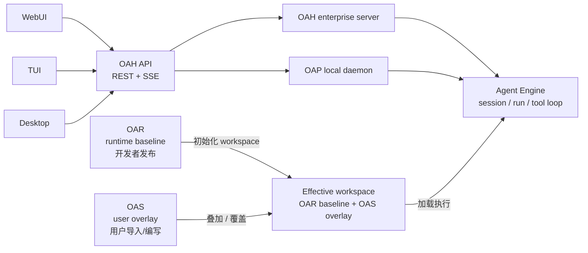
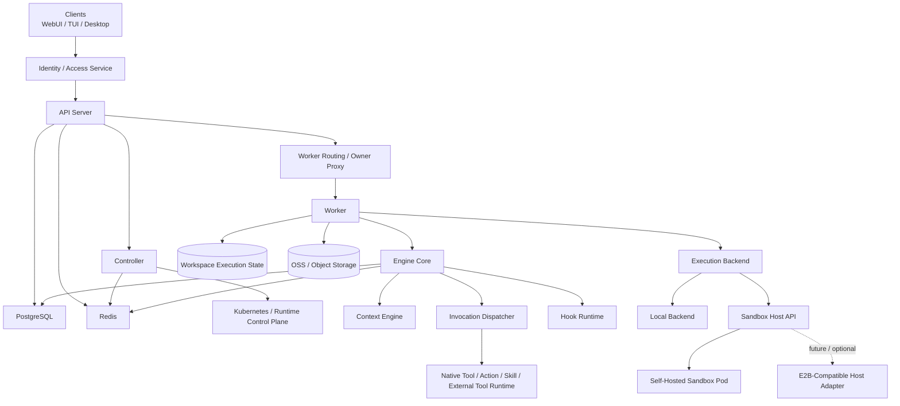
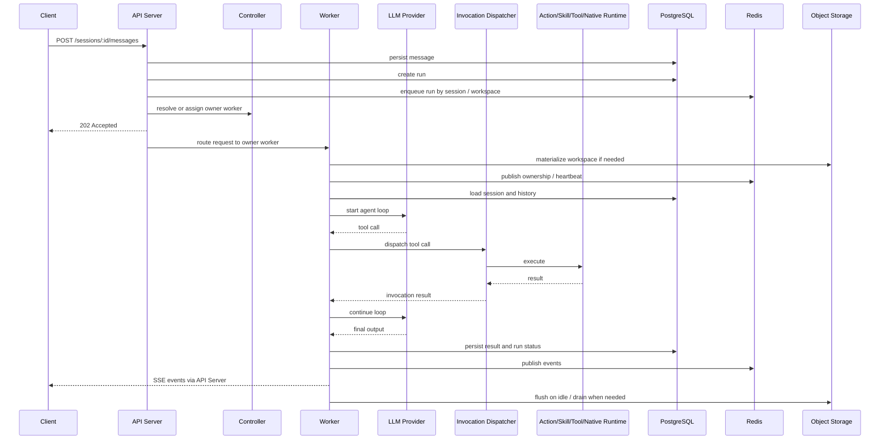

# 架构总览

## 1. 定位

Open Agent Harness 是一个 headless Agent Engine。不绑定某一种产品 UI，通过 OpenAPI + SSE 暴露能力，官方客户端形态收敛为 WebUI、TUI 和 Desktop。仓库里的 WebUI 和 TUI 都连接同一套 API，用来操作和观察 workspace、session、run 和存储状态；Desktop 也应遵循同一套 API / profile 约定。

OAH 的产品层级可以按基础设施体系理解：

| 缩写 | 名称 | 定位 |
| --- | --- | --- |
| `OAR` | Open Agent Runtime | 面向开发者的运行时包层。定义一个可发布、可复用、可初始化 workspace 的 runtime 组织方式。 |
| `OAS` | Open Agent Spec | 面向实际用户的 Spec 层。特指用户基于 OAR / runtime 叠加的配置与导入资源，例如 `AGENTS.md`、`.openharness/memory/MEMORY.md`、用户导入的 `tool` / `skill` / `model`。 |
| `OAH` | Open Agent Harness | 企业/平台部署。面向 Compose、Kubernetes、PostgreSQL、Redis、对象存储、sandbox fleet 和多 worker。 |
| `OAP` | Open Agent Harness Personal | 个人部署。面向本地 daemon、SQLite、本地磁盘、embedded worker 和单用户工作流。 |

`OAH` 与 `OAP` 都应暴露同一套 OAH-compatible API；WebUI、TUI、Desktop 都只是 client，不绑定某一种部署形态。Desktop 不是 OAP 专属，它连接 OAP 时才启用本地 daemon supervisor 能力：

```text
WebUI     ┐
TUI       ├── OAH API ── OAH enterprise server
Desktop   ┘          └── OAP local daemon
```

OAR 与 OAS 的关系是“基线 + 叠加”，不是两套互不相干的输入。OAR 提供可发布的 runtime baseline，OAS 是用户在该 baseline 之上加入或覆盖的 workspace 级配置，最终由服务层加载成 effective workspace：



因此，本地个人版和企业版的关键差异应落在部署 profile、存储后端、worker / sandbox 形态和默认目录，而不是协议或客户端能力上。

客户端连接任意 OAH-compatible API 后，应先读取 server profile，例如 `GET /api/v1/system/profile`。服务端需要明确自报 `edition=enterprise` 还是 `edition=personal`，以及是否支持 local daemon control、local workspace paths、model management 等 capabilities。WebUI、TUI、Desktop 只能基于 profile / capabilities 开关行为，不能靠 URL、端口或是否 localhost 猜测当前是 OAH 还是 OAP。

两类使用者：

- **平台开发者** -- 定义 agent、action、skill、tool、hook
- **调用方** -- 打开 workspace，与 agent 协作执行任务

两种 workspace：

| Kind | 说明 |
|------|------|
| `project` | 完整项目 workspace，可启用工具、执行和本地运行时数据 |
| `workspace` | 统一 workspace，加载 prompt / agent / model / action / skill / tool / hook |

## 2. 设计原则

- **Workspace First** -- 平台提供运行时，workspace 声明能力。除模型凭证外，项目级能力在 workspace 内定义。
- **Session Serial, System Parallel** -- 同 session 内 run 串行；不同 session 可并发；单 run 内工具并发由 agent 策略控制。
- **Domain Separate, Invocation Unified** -- action / skill / tool / native tool 在领域、配置、治理层分离，对 LLM 统一投影为 tool calling。
- **Local First, Sandbox Ready** -- 默认本地执行；执行层从第一天起可替换；后续可接容器 / VM / 远程执行器。
- **Identity Externalized** -- 不维护用户系统，只消费外部身份与访问上下文。
- **Auditable by Default** -- 所有 run、tool call、action run、hook run 均有结构化记录。
- **Central Truth, Local Runtime State** -- PostgreSQL 是中心事实源；workspace 下 `history.db` 仅保存本地运行时数据，不参与跨进程同步。
- **Embedded by Default, Controlled in Production** -- 默认可用 `oah-api` 内嵌 embedded worker；生产环境采用 `oah-api + oah-controller + oah-sandbox` 拆分部署。

## 3. 正式术语

### Agent Engine / Agent Runtime / Agent Spec

- `Agent Engine`：执行、调度、恢复、审计与 API 暴露系统
- `Agent Runtime`：实际被运行的主对象，旧称 `blueprint`
- `Agent Spec`：基于某个 runtime / workspace baseline 额外叠加的用户扩展层，主要包括 `AGENTS.md`、`.openharness/memory/MEMORY.md` 与额外加载的 `model` / `tool` / `skill`
- 记忆方式：`Engine` 关注 how it runs，`Runtime` 关注 what runs，`Spec` 关注 what the user adds

### API Server

- OAH 的统一外部入口
- 负责 OpenAPI、SSE、caller context、鉴权接入、元数据落库与 owner 路由
- 可运行 embedded worker，也可运行在 `api-only` 模式

### Worker

- OAH 的统一执行运行时角色
- 负责 run 执行、session 串行、tool loop、workspace 文件访问、workspace materialization、flush / evict
- `Worker` 是职责，不是部署形态

### Controller

- OAH 的控制面角色
- 负责 workspace placement、owner affinity、capacity、drain、recovery、rebalance 和扩缩容
- `Controller` 不直接执行业务 run

### Sandbox

- Worker 所运行的隔离宿主环境
- 可以是本地进程、独立 Pod、容器或后续 VM / 远程执行器
- `Sandbox` 描述执行环境，不替代 `Worker`
- `embedded` provider 下没有独立 sandbox 进程，worker 直接内嵌在 `oah-api`
- `self_hosted / e2b` provider 下，standalone worker 必须运行在真实 sandbox 内

### Sandbox Host API

- Worker 与宿主环境之间的稳定适配边界
- 首个实现应是 OAH 自己的 sandbox pod
- 对外 provider 统一为 `embedded | self_hosted | e2b`，目标是只改服务端配置即可切换 backend
- 只承载宿主生命周期、文件访问、进程执行等能力，不改变 OAH 的 ownership 与控制面语义
- 当前 `e2b` 路线也以“真实 sandbox 内承载 standalone worker”为正式语义，而不是外部 worker 间接驱动 E2B

### Workspace

- Workspace 是项目、能力发现和会话归属的逻辑边界
- 它描述的是“这个 agent 在哪个项目上下文里工作”，不是“运行在哪个宿主里”
- workspace 可以被 materialize 到某个 worker 持有的 `Active Workspace Copy` 中执行
- 同一个 sandbox 可以按容量承载多个 workspace；同一个 workspace 在活跃期只应有一个 owner worker 持有其读写真值

### Workspace Ownership

- `workspace -> owner worker` 是运行与文件路由真值
- `ownerId` 是亲和调度键，但不是独立于 `workspace -> owner worker` 之外的另一套 ownership 真值
- 活跃 workspace 的当前读写真值位于 owner worker 的 `Active Workspace Copy`；空闲 flush 后再回到 OSS / 外部存储真值

### 层级关系

推荐按下面这条链路理解系统层级：

`Agent Engine -> Worker -> Sandbox -> Active Workspace Copy`

同时要和逻辑对象层分开看：

`Agent Engine -> Workspace -> Session -> Run`

换句话说：

- `workspace` 是逻辑对象和能力边界
- `sandbox` 是执行宿主和文件/进程隔离边界
- `worker` 是在宿主中运行的执行角色
- 活跃 workspace 会被 materialize 成 `Active Workspace Copy`
- `runtime` 只负责初始化 workspace，不替代 workspace / sandbox / worker 任一层概念

## 4. 分层架构



## 5. 核心模块

### API Server

- 提供 OpenAPI 接口和 SSE 事件流
- 接收 / 校验来自上游的 caller context
- 访问控制、限流、参数校验、元数据写入
- 创建 workspace / session / message / run
- 查询 workspace owner，并把 run / file 请求路由到 owner worker
- 默认含 embedded worker；`api-only` 模式下只承担接口与路由职责

### Worker

- 复用 `packages/engine-core` 执行业务逻辑
- 消费 run、执行模型 <-> 工具循环
- 保证同 session 串行
- 管理取消、超时、失败恢复
- 负责 workspace materialization、本地文件访问、flush / evict
- 可以 embedded 在 API Server 中，也可以 standalone 运行于独立 Pod
- 对远端 provider 而言，worker 持有的是 sandbox 内的 `Active Workspace Copy`，而不是直接在中心存储上原地执行

### Controller

- 负责 workspace placement 与 worker 生命周期治理
- 将 `owner affinity + workspace ownership + worker health + capacity` 组合为放置决策
- 在 `self_hosted / e2b` provider 下进一步推导 sandbox fleet 需求：同 `ownerId` 复用 sandbox；无 owner 默认进入共享池，优先复用 CPU / memory / disk 都未超过阈值的已有 sandbox，任一资源超过阈值后再落到 warm empty sandbox
- 负责 drain、rebalance、recovery 与扩缩容
- 不直接执行业务 run

### Sandbox Host API

- 统一封装 worker 所需的宿主能力
- 建议只覆盖：
  - sandbox / session 创建与复用
  - workspace materialization / mount
  - 文件读写与下载
  - 命令执行 / 进程管理
  - 健康检查、drain、关闭
- 当前以自家 sandbox pod 为参考实现，对外只追求与 E2B 的“可兼容切换”，不追求先重塑成 E2B 原生资源模型

### Engine Core

- 加载 workspace 配置：`AGENTS.md`、`settings.yaml`、agents、models
- 加载平台级 model / tool / skill 目录
- 组装 system prompt、历史消息和能力清单
- `project` workspace：完整加载所有能力类型
- workspace：统一加载 agent / model / AGENTS.md，以及声明的 action / skill / tool / hook
- 负责 run 状态机、session 串行、tool loop、审计与恢复闭环

### Invocation Dispatcher

- 将 tool call 名称映射回来源（native / action / skill / external）
- 转发到对应执行器
- 统一封装参数解析、审计、超时和结果回传

### Execution Backend

- 统一封装 workspace 执行环境（shell、文件读写、进程管理）
- 屏蔽本地执行、自家 sandbox pod 与未来 E2B 类宿主的差异
- workspace 统一创建 backend session，并在同一执行后端内处理
- 文件与命令执行永远发生在活跃 workspace 的 `Active Workspace Copy` 上；这个副本可能在 embedded 进程里，也可能在远端 sandbox 里

### Hook Runtime

- 执行 lifecycle hook（run 事件）和 interceptor hook（tool / model 事件）
- 在安全边界内允许改写请求和执行逻辑

## 6. 推荐部署模式

| 模式 | 说明 |
|------|------|
| `oah-api` + embedded worker | 最小化部署。一个 API 进程内直接承载 embedded worker。 |
| `oah-api` + `oah-controller` + `oah-sandbox` | 推荐主模式。`oah-api` 负责入口，`oah-controller` 负责控制面，`oah-sandbox` 内承载 standalone worker。 |
| Standalone worker in sandbox | standalone worker 的典型部署形态。worker 运行在 self-hosted sandbox 或 E2B sandbox 中。 |
| `oah-api` + `oah-controller` + E2B sandbox | 远端 sandbox 形态。standalone worker 运行在真实 E2B sandbox 内，但 API 与控制面语义不变。 |

## 7. 请求链路



## 8. 关键决策

- 不内建用户系统，只消费外部身份上下文
- Workspace 是配置和能力发现边界；`.openharness/settings.yaml` 是 workspace 总配置入口
- 平台内建 agent 与 workspace agent 合并可见；同名时 workspace agent 覆盖
- Runtime 只用于初始化 workspace，Engine 只读取当前 workspace 文件
- workspace 统一从 `workspace_dir` 管理，`runtime_dir` 仅用于初始化复制
- `AGENTS.md` 按原文全文注入，不做摘要
- Agent 以 `agents/*.md` 定义，frontmatter 承载结构化字段，正文承载 system prompt
- Model / Hook / Tool Server 采用 YAML 声明式定义
- Action 采用 `actions/*/ACTION.yaml`，Skill 采用 `skills/*/SKILL.md`
- 所有能力对 LLM 统一投影为 tool calling，但在领域层和治理层保持分离
- `Worker` 是统一执行角色；`sandbox` 只是 worker 的宿主环境，不作为主术语替代 worker
- `Workspace` 是逻辑项目边界；`sandbox` 是执行宿主边界，二者不是上下位同类概念
- `Sandbox Host API` 是宿主兼容边界；首个实现应是自家 sandbox pod，E2B 适合作为后续可插拔后端，而不是先改写 OAH 的主语义
- `Controller` 是统一控制面角色；负责 placement、lifecycle 与 capacity，不直接执行业务 run
- 对远端 sandbox provider 而言，controller 同时承担逻辑 sandbox fleet 计算与 scale target reconciliation；Compose 本地栈通过 `oah-compose-scaler` 执行，K8S 通过 `Deployment /scale` 执行
- `workspace -> owner worker` 是运行与文件访问的路由真值；`ownerId` 用于亲和调度，但不应被当作第二套 ownership 真值
- 活跃 workspace 以 owner worker 的 `Active Workspace Copy` 为读写真值；flush / evict 后回到 OSS / 外部存储真值
- `sandbox` API 面向“活跃执行副本”的文件与命令操作；`workspace` API 面向元数据、catalog 与生命周期管理
- 默认可信内网环境，不做强隔离容器执行；若面向更开放环境，应优先加强 sandbox backend
- PostgreSQL 是中心事实源；workspace 本地状态文件仅作为本地运行时状态，不承担跨进程同步职责

## 9. 技术栈

| 层 | 选型 |
|----|------|
| 语言 | TypeScript / Node.js |
| API | OpenAPI 3.1 + HTTP + SSE |
| 数据库 | PostgreSQL |
| 队列与协调 | Redis |
| 本地运行时数据 | SQLite |
| 模型层 | Vercel AI SDK + 双层 model registry |
