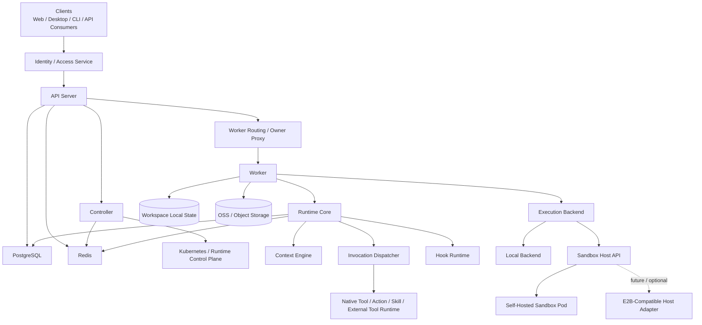
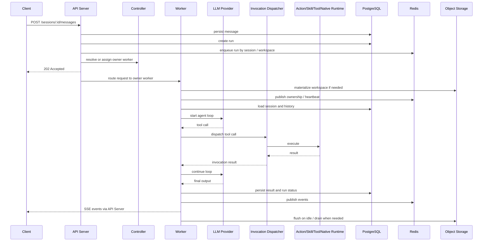

# 架构总览

## 1. 定位

Open Agent Harness 是一个 headless Agent Runtime。不提供 UI，通过 OpenAPI + SSE 暴露能力，供 Web、桌面、CLI 或自动化系统接入。

两类使用者：

- **平台开发者** -- 定义 agent、action、skill、tool、hook
- **调用方** -- 打开 workspace，与 agent 协作执行任务

两种 workspace：

| Kind | 说明 |
|------|------|
| `project` | 完整项目 workspace，可启用工具、执行和本地运行时数据 |
| `chat` | 只读对话 workspace，只加载 prompt / agent / model，不允许执行 |

## 2. 设计原则

- **Workspace First** -- 平台提供运行时，workspace 声明能力。除模型凭证外，项目级能力在 workspace 内定义。
- **Session Serial, System Parallel** -- 同 session 内 run 串行；不同 session 可并发；单 run 内工具并发由 agent 策略控制。
- **Domain Separate, Invocation Unified** -- action / skill / tool / native tool 在领域、配置、治理层分离，对 LLM 统一投影为 tool calling。
- **Local First, Sandbox Ready** -- 默认本地执行；执行层从第一天起可替换；后续可接容器 / VM / 远程执行器。
- **Identity Externalized** -- 不维护用户系统，只消费外部身份与访问上下文。
- **Auditable by Default** -- 所有 run、tool call、action run、hook run 均有结构化记录。
- **Central Truth, Local Runtime State** -- PostgreSQL 是中心事实源；workspace 下 `history.db` 仅保存本地运行时数据，不参与跨进程同步。
- **Embedded by Default, Controlled in Production** -- 默认 API + embedded worker 单进程运行；生产环境采用 `API Server + Worker + Controller` 拆分部署。

## 3. 正式术语

### API Server

- OAH 的统一外部入口
- 负责 OpenAPI、SSE、caller context、鉴权接入、元数据落库与 owner 路由
- 可运行 embedded worker，也可运行在 `api-only` 模式

### Worker

- OAH 的统一执行运行时角色
- 负责 run 执行、session 串行、tool loop、workspace 文件访问、workspace materialization、flush / evict
- `Worker` 是职责，不是部署形态

### Controller

- OAH 的控制面角色
- 负责 workspace placement、user affinity、capacity、drain、recovery、rebalance 和扩缩容
- `Controller` 不直接执行业务 run

### Sandbox

- Worker 所运行的隔离宿主环境
- 可以是本地进程、独立 Pod、容器或后续 VM / 远程执行器
- `Sandbox` 描述执行环境，不替代 `Worker`

### Sandbox Host API

- Worker 与宿主环境之间的稳定适配边界
- 首个实现应是 OAH 自己的 sandbox pod
- 后续可兼容 E2B 一类远程 sandbox 提供方
- 只承载宿主生命周期、文件访问、进程执行等能力，不改变 OAH 的 ownership 与控制面语义

### Workspace Ownership

- `workspace -> owner worker` 是运行与文件路由真值
- `userId` 是调度亲和键，不是 ownership 真值
- 活跃 workspace 的当前读写真值位于 owner worker 的本地副本；空闲 flush 后再回到 OSS / 外部存储真值

## 4. 分层架构

## 5. 核心模块

### API Server

- 提供 OpenAPI 接口和 SSE 事件流
- 接收 / 校验来自上游的 caller context
- 访问控制、限流、参数校验、元数据写入
- 创建 workspace / session / message / run
- 查询 workspace owner，并把 run / file 请求路由到 owner worker
- 默认含 embedded worker；`api-only` 模式下只承担接口与路由职责

### Worker

- 复用 `packages/runtime-core` 执行业务逻辑
- 消费 run、执行模型 <-> 工具循环
- 保证同 session 串行
- 管理取消、超时、失败恢复
- 负责 workspace materialization、本地文件访问、flush / evict
- 可以 embedded 在 API Server 中，也可以 standalone 运行于独立 Pod

### Controller

- 负责 workspace placement 与 worker 生命周期治理
- 将 `user affinity + workspace ownership + worker health + capacity` 组合为放置决策
- 负责 drain、rebalance、recovery 与扩缩容
- 不直接执行业务 run

### Sandbox Host API

- 统一封装 worker 所需的宿主能力
- 建议只覆盖：
  - sandbox / session 创建与复用
  - workspace materialization / mount
  - 文件读写与下载
  - 命令执行 / 进程管理
  - 健康检查、drain、关闭
- 当前以自家 sandbox pod 为参考实现，对外只追求与 E2B 的“可兼容切换”，不追求先重塑成 E2B 原生资源模型

### Runtime Core

- 加载 workspace 配置：`AGENTS.md`、`settings.yaml`、agents、models
- 加载平台级 model / tool / skill 目录
- 组装 system prompt、历史消息和能力清单
- `project` workspace：完整加载所有能力类型
- `chat` workspace：只加载 agent / model / AGENTS.md，工具清单为空
- 负责 run 状态机、session 串行、tool loop、审计与恢复闭环

### Invocation Dispatcher

- 将 tool call 名称映射回来源（native / action / skill / external）
- 转发到对应执行器
- 统一封装参数解析、审计、超时和结果回传

### Execution Backend

- 统一封装 workspace 执行环境（shell、文件读写、进程管理）
- 屏蔽本地执行、自家 sandbox pod 与未来 E2B 类宿主的差异
- `chat` workspace 不创建 backend session

### Hook Runtime

- 执行 lifecycle hook（run 事件）和 interceptor hook（tool / model 事件）
- 在安全边界内允许改写请求和执行逻辑

## 6. 推荐部署模式

| 模式 | 说明 |
|------|------|
| API + embedded worker | 默认。单进程完整执行。配置 Redis 时消费 Redis queue，否则 in-process 执行。 |
| API only + standalone worker + controller | 生产主模式。API Server 负责入口与 owner 路由，Worker 负责执行，Controller 负责控制面。 |
| Standalone worker in sandbox | Worker 的一种部署形态。worker 运行在独立 worker Pod / sandbox Pod 中。 |
| API only + controller + sandbox-hosted worker | 推荐的演进方向。先使用自家 sandbox pod 承载 worker，再把宿主接口收敛到可兼容 E2B 的边界。 |

## 7. 请求链路

## 8. 关键决策

- 不内建用户系统，只消费外部身份上下文
- Workspace 是配置和能力发现边界；`.openharness/settings.yaml` 是 workspace 总配置入口
- 平台内建 agent 与 workspace agent 合并可见；同名时 workspace agent 覆盖
- 模板只用于初始化，运行时只读当前 workspace 文件
- `chat_dir` 下的子目录直接可用，不走模板复制
- `AGENTS.md` 按原文全文注入，不做摘要
- Agent 以 `agents/*.md` 定义，frontmatter 承载结构化字段，正文承载 system prompt
- Model / Hook / Tool Server 采用 YAML 声明式定义
- Action 采用 `actions/*/ACTION.yaml`，Skill 采用 `skills/*/SKILL.md`
- 所有能力对 LLM 统一投影为 tool calling，但在领域层和治理层保持分离
- `Worker` 是统一执行角色；`sandbox` 只是 worker 的宿主环境，不作为主术语替代 worker
- `Sandbox Host API` 是宿主兼容边界；首个实现应是自家 sandbox pod，E2B 适合作为后续可插拔后端，而不是先改写 OAH 的主语义
- `Controller` 是统一控制面角色；负责 placement、lifecycle 与 capacity，不直接执行业务 run
- `workspace -> owner worker` 是运行与文件访问的路由真值；`userId` 只用于亲和调度，不作为 ownership 真值
- 活跃 workspace 以 owner worker 本地副本为读写真值；flush / evict 后回到 OSS / 外部存储真值
- 默认可信内网环境，不做强隔离容器执行；若面向更开放环境，应优先加强 sandbox backend
- PostgreSQL 是中心事实源；workspace 本地状态文件仅作为本地运行时状态，不承担跨进程同步职责

## 9. 技术栈

| 层 | 选型 |
|----|------|
| 语言 | TypeScript / Node.js |
| API | OpenAPI 3.1 + HTTP + SSE |
| 数据库 | PostgreSQL |
| 队列与协调 | Redis |
| 本地运行时数据 | SQLite |
| 模型层 | Vercel AI SDK + 双层 model registry |
