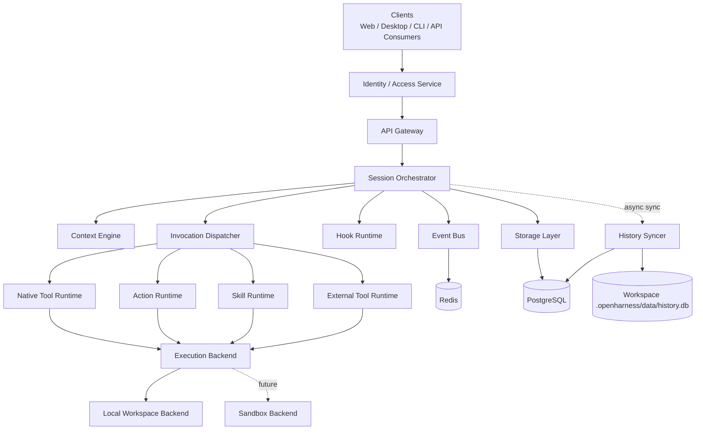
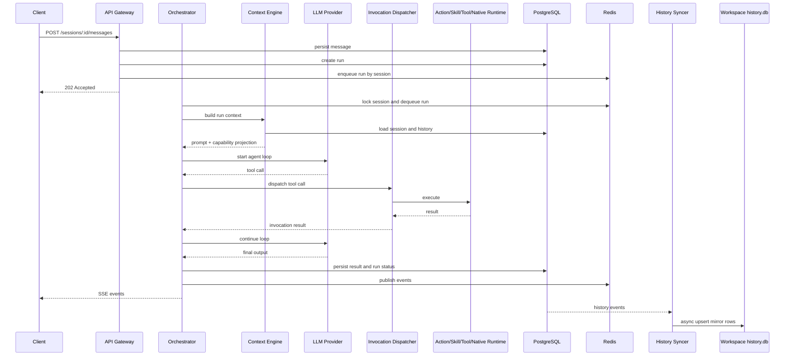

# 架构总览

## 1. 定位

Open Agent Harness 是一个 headless Agent Runtime。不提供 UI，通过 OpenAPI + SSE 暴露能力，供 Web、桌面、CLI 或自动化系统接入。

两类使用者：

- **平台开发者** -- 定义 agent、action、skill、tool、hook
- **调用方** -- 打开 workspace，与 agent 协作执行任务

两种 workspace：

| Kind | 说明 |
|------|------|
| `project` | 完整项目 workspace，可启用工具、执行和本地历史镜像 |
| `chat` | 只读对话 workspace，只加载 prompt / agent / model，不允许执行 |

## 2. 设计原则

- **Workspace First** -- 平台提供运行时，workspace 声明能力。除模型凭证外，项目级能力在 workspace 内定义。
- **Session Serial, System Parallel** -- 同 session 内 run 串行；不同 session 可并发；单 run 内工具并发由 agent 策略控制。
- **Domain Separate, Invocation Unified** -- action / skill / tool / native tool 在领域、配置、治理层分离，对 LLM 统一投影为 tool calling。
- **Local First, Sandbox Ready** -- 默认本地执行；执行层从第一天起可替换；后续可接容器 / VM / 远程执行器。
- **Identity Externalized** -- 不维护用户系统，只消费外部身份与访问上下文。
- **Auditable by Default** -- 所有 run、tool call、action run、hook run 均有结构化记录。
- **Central Truth, Local Mirror** -- PostgreSQL 是事实源；workspace 下 `history.db` 仅做异步镜像，不参与在线调度。
- **Embedded by Default, Split in Production** -- 默认 API + embedded worker 单进程运行；生产环境支持 API only + standalone worker 拆分。

## 3. 分层架构

## 4. 核心模块

### API Gateway

- 提供 OpenAPI 接口和 SSE 事件流
- 接收 / 校验来自上游的 caller context
- 访问控制、限流、参数校验
- 默认含 embedded worker；`api-only` 模式下只承担接口职责

### Session Orchestrator

- 创建 run 并投递到 session 队列
- 保证同 session 串行
- 驱动模型 <-> 工具循环
- 管理取消、超时、失败恢复

### Context Engine

- 加载 workspace 配置：`AGENTS.md`、`settings.yaml`、agents、models
- 加载平台级 model / tool / skill 目录
- 组装 system prompt、历史消息和能力清单
- `project` workspace：完整加载所有能力类型
- `chat` workspace：只加载 agent / model / AGENTS.md，工具清单为空

### Invocation Dispatcher

- 将 tool call 名称映射回来源（native / action / skill / external）
- 转发到对应执行器
- 统一封装参数解析、审计、超时和结果回传

### Execution Backend

- 统一封装 workspace 执行环境（shell、文件读写、进程管理）
- 屏蔽本地执行与未来沙箱执行的差异
- `chat` workspace 不创建 backend session

### Hook Runtime

- 执行 lifecycle hook（run 事件）和 interceptor hook（tool / model 事件）
- 在安全边界内允许改写请求和执行逻辑

### History Syncer

- 消费 PostgreSQL 中的历史增量事件
- 异步写入 workspace 下的 `history.db`
- 维护同步游标、重试和重建逻辑
- 镜像失败不阻塞主请求
- 仅对 `kind=project` 且启用镜像的 workspace 生效

## 5. 进程模式

| 模式 | 说明 |
|------|------|
| API + embedded worker | 默认。单进程完整执行。配置 Redis 时消费 Redis queue，否则 in-process 执行。 |
| API only | 仅承担接口接入，需配合独立 worker。 |
| Standalone worker | 独立消费 Redis queue，负责 run 执行和 history mirror sync。 |

## 6. 请求链路

## 7. 关键决策

- 不内建用户系统，只消费外部身份上下文
- Workspace 是配置和能力发现边界；`.openharness/settings.yaml` 是 workspace 总配置入口
- 平台内建 agent 与 workspace agent 合并可见；同名时 workspace agent 覆盖
- 模板只用于初始化，运行时只读当前 workspace 文件
- `chat_dir` 下的子目录直接可用，不走模板复制
- `AGENTS.md` 按原文全文注入，不做摘要
- Agent 以 `agents/*.md` 定义，frontmatter 承载结构化字段，正文承载 system prompt
- Model / Hook / Tool Server 采用 YAML 声明式定义
- Action 采用 `actions/*/ACTION.yaml`，Skill 采用 `skills/*/SKILL.md`
- 所有能力对 LLM 统一投影为 tool calling，但在领域层和治理层保持分离
- 默认可信内网环境，不做强隔离容器执行
- PostgreSQL 是事实源；`history.db` 仅做异步镜像

## 8. 技术栈

| 层 | 选型 |
|----|------|
| 语言 | TypeScript / Node.js |
| API | OpenAPI 3.1 + HTTP + SSE |
| 数据库 | PostgreSQL |
| 队列与协调 | Redis |
| 本地历史镜像 | SQLite |
| 模型层 | Vercel AI SDK + 双层 model registry |
