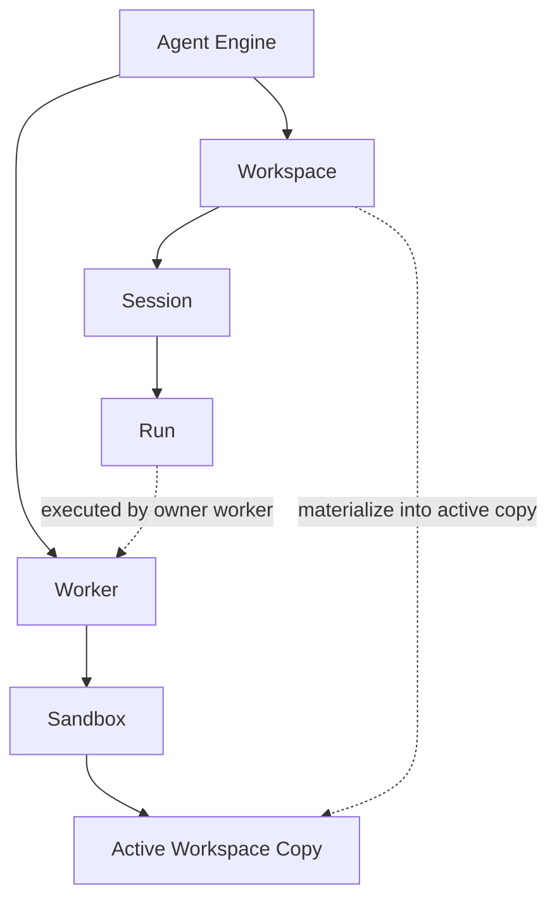

# 概念关系

这页专门回答一个问题：

这些概念到底怎么放在同一张图里理解？

如果你只记一句话，记这个：

`workspace` 是逻辑项目边界，`sandbox` 是执行宿主边界，`worker` 是在宿主中运行的执行角色。

## 两条主链路

系统里有两条需要同时看的链路：

### 逻辑链路

`Agent Engine -> Workspace -> Session -> Run`

这条链路回答：

- 当前是哪个项目
- 这个项目声明了哪些能力
- 会话属于谁
- 一次执行如何落在某个 run 上

### 执行链路

`Agent Engine -> Worker -> Sandbox -> Active Workspace Copy`

这条链路回答：

- 由谁执行
- 在哪个宿主里执行
- 文件和命令实际落在什么执行副本上

## 一张图

## 各概念到底是什么

| 概念 | 它是什么 | 它不是什么 |
| --- | --- | --- |
| `Agent Engine` | 调度、执行、恢复、审计、API / SSE 暴露系统 | 不是单个 agent 定义 |
| `Workspace` | 项目、能力发现、会话归属边界 | 不是执行宿主 |
| `Session` | 某个 workspace 下的一段连续协作上下文 | 不是执行线程 |
| `Run` | 一次模型推理与工具循环 | 不是长期驻留对象 |
| `Worker` | 承载 run 执行的角色 | 不是项目本身 |
| `Sandbox` | worker 所在的文件系统与进程宿主环境 | 不是 workspace 的别名 |
| `Active Workspace Copy` | 活跃 workspace 在宿主中的实际执行副本，也就是 sandbox 里真正被读写和执行命令的那份文件 | 不是新的 workspace 类型 |
| `Runtime` | 新建 workspace 时使用的初始化源 | 不是当前活跃执行副本 |
| `Spec` | 用户额外叠加给 runtime 的扩展层 | 不是整个 runtime 结构 |

## 最容易混的三组概念

### Workspace vs Sandbox

| 对比项 | Workspace | Sandbox |
| --- | --- | --- |
| 关注点 | 项目与能力 | 宿主与执行环境 |
| 回答的问题 | “这是哪个项目？” | “当前在哪儿跑？” |
| 典型内容 | `AGENTS.md`、agents、models、skills、hooks | 文件系统、进程、命令执行、挂载点 |
| API 主语 | `/workspaces` | `/sandboxes` |

结论：

- workspace 定义项目身份和能力集合
- sandbox 定义活跃副本的文件系统与进程上下文

### Workspace vs Runtime

| 对比项 | Workspace | Runtime |
| --- | --- | --- |
| 关注点 | 当前项目 | 初始化来源 |
| 何时使用 | 运行中、发现能力、执行任务 | `POST /workspaces` 创建时 |
| 是否参与当前执行 | 是 | 否 |

结论：

- runtime 负责“从什么初始化”
- workspace 负责“当前到底在运行什么项目”

### Worker vs Sandbox

| 对比项 | Worker | Sandbox |
| --- | --- | --- |
| 关注点 | 执行角色 | 执行宿主 |
| 回答的问题 | “谁在执行？” | “执行发生在哪个环境里？” |
| 典型动作 | 消费 run、驱动 tool loop、flush / evict | 提供文件、进程、命令、挂载、生命周期 |

结论：

- worker 是角色
- sandbox 是 worker 所处环境

## 为什么文件 API 是 Sandbox-Scoped

文件读写和命令执行总是针对“活跃执行副本”进行，而不是针对抽象的 workspace 元数据。

因此：

- 查 catalog、查元数据、创建或删除项目时，用 `/workspaces`
- 读文件、写文件、执行命令时，用 `/sandboxes`

这是为了保证：

- `embedded`
- `self_hosted`
- `e2b`

三种 provider 下，上层 API 语义保持一致。

## 活跃 Workspace 是怎么流动的

典型过程：

1. workspace 在逻辑上被创建或导入
2. controller / owner routing 决定它归哪个 worker
3. worker 在自己的执行环境里 materialize 出该 workspace 的执行副本
4. run 在这个执行副本上执行文件读写、命令和工具调用
5. workspace 空闲、drain 或删除时，再 flush / evict 回外部存储或受管源目录

## Embedded 与 Remote 的区别

| 模式 | 活跃执行副本通常在哪 |
| --- | --- |
| `embedded` | 本机进程可访问的本地 workspace |
| `self_hosted` | 远端 sandbox 内的执行副本 |
| `e2b` | 远端 E2B sandbox 内的执行副本 |

注意：

- 逻辑上的 workspace 身份不变
- 变化的只是活跃执行副本所在的宿主位置

## 读文档时怎么用这张图

如果你在看：

- `terminology.md`
  看命名边界
- `workspace/README.md`
  看 workspace 里声明什么
- `server-config.md`
  看这些对象在部署里落到哪里
- `openapi/workspaces.md`
  看项目与能力对象怎么管理
- `openapi/files.md`
  看活跃执行副本怎么暴露文件和命令能力

## 推荐记忆法

按顺序记：

1. `Runtime` 初始化 `Workspace`
2. `Spec` 扩展 `Runtime`
3. `Engine` 运行 `Workspace`
4. `Worker` 在 `Sandbox` 里执行 `Run`
5. 活跃 `Workspace` 会 materialize 成 `Active Workspace Copy`
