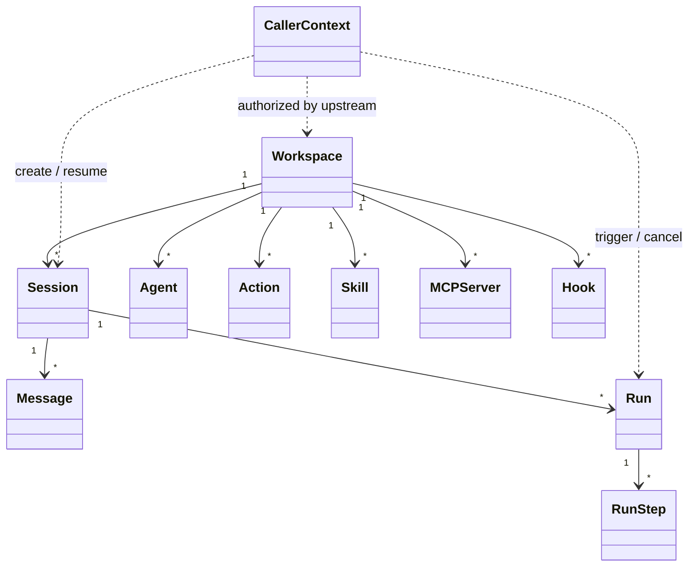

# Domain Model

## 1. 领域对象总览

Open Agent Harness 的领域对象可分为四类：

- 访问上下文与工作区域
- 对话与执行域
- 能力定义域
- 运行时扩展域

## 2. 访问上下文与工作区域

### 2.1 CallerContext

CallerContext 表示一次请求携带的外部身份与访问上下文。

它不是平台内建用户对象，也不是需要长期维护的注册表实体，而是由外部认证服务、API Gateway 或上游业务系统传入，运行时只消费其中与审计、限流、访问控制相关的信息。

主要字段：

- `subject_ref`
- `scopes`
- `workspace_access`
- `auth_source`
- `metadata`

说明：

- `subject_ref` 是外部系统中的主体引用，建议保持 opaque string
- 可以是用户、服务账号、自动化任务或其他调用主体
- 运行时只持久化必要字段，不维护用户生命周期

### 2.2 Workspace

Workspace 表示一个项目工作目录，是配置发现、执行环境和运行策略绑定的核心对象。

主要字段：

- `id`
- `kind`
- `external_ref`
- `name`
- `root_path`
- `execution_policy`
- `status`
- `metadata`
- `created_at`
- `updated_at`

说明：

- `kind` 建议支持 `project`、`chat`
- `execution_policy` 默认是 `local`
- `kind=chat` 时，`execution_policy` 应视为 `none`
- 后续可扩展为 `container`、`remote_runner`
- `external_ref` 用于映射外部系统中的项目、仓库或业务对象
- workspace 默认 agent 来自 `.openharness/settings.yaml`，可指向当前可见 catalog 中的 platform agent 或 workspace agent

补充约束：

- `project` workspace 用于常规项目协作，可按 agent allowlist 暴露工具与执行能力
- `chat` workspace 用于只读普通对话，只加载 prompt、agent、model 等静态配置
- `chat` workspace 不允许修改 workspace 内容，不允许执行 shell、文件写入、action、skill、mcp、hook
- `chat` workspace 的会话和消息仍保存在中心数据库，但不会在 workspace 内创建本地历史镜像库

## 3. 对话与执行域

### 3.1 Session

Session 表示某个调用主体在某个 workspace 下的一条会话。

主要字段：

- `id`
- `workspace_id`
- `subject_ref`
- `agent_name`
- `active_agent_name`
- `title`
- `status`
- `last_run_at`
- `auth_context`
- `created_at`
- `updated_at`

设计约束：

- 一个 session 同时最多只能有一个 active run
- 一个 session 绑定一个当前 agent，但允许后续切换 agent
- `subject_ref` 只用于审计和访问追踪，不要求在本系统中有对应用户表
- `active_agent_name` 表示当前 session 后续默认使用的 primary agent

### 3.2 Message

Message 表示对话消息。

主要字段：

- `id`
- `session_id`
- `run_id`
- `role`
- `content`
- `tool_name`
- `tool_call_id`
- `metadata`
- `created_at`

说明：

- `role` 可取 `user`、`assistant`、`tool`、`system`
- tool invocation 结果也以 message 形式沉淀，便于重建上下文

### 3.3 Run

Run 表示一次实际执行。

主要字段：

- `id`
- `workspace_id`
- `session_id`
- `trigger_type`
- `trigger_ref`
- `initiator_ref`
- `agent_name`
- `effective_agent_name`
- `switch_count`
- `status`
- `started_at`
- `ended_at`
- `error_code`
- `error_message`
- `metadata`

说明：

- `trigger_type` 可取 `message`、`manual_action`、`api_action`、`hook`、`system`
- `session_id` 可为空，用于承载脱离会话的独立 action run
- 同一个 session 的多个 run 由队列串行执行
- `initiator_ref` 通常来自外部 caller context
- `agent_name` 表示 run 启动时的初始 agent
- `effective_agent_name` 表示当前 run 此刻实际绑定的 agent，可在 run 内切换时变化
- `switch_count` 用于限制一次 run 内的 agent 切换次数

### 3.4 RunStep

RunStep 表示 run 内的步骤级记录。

主要字段：

- `id`
- `run_id`
- `seq`
- `step_type`
- `name`
- `agent_name`
- `status`
- `input`
- `output`
- `started_at`
- `ended_at`

用途：

- 追踪 Agent Loop 中每一步
- 为后续诊断、审计和可视化提供基础
- 当 `step_type=agent_switch` 或 `step_type=agent_delegate` 时，可记录 agent 间控制流

## 4. 能力定义域

### 4.1 Agent

Agent 是调用方可见的协作主体，定义其行为、权限和可访问能力。

典型职责：

- 选择模型入口
- 配置系统 prompt
- 配置 agent 激活或切换时的 `system_reminder`
- 配置可访问的 action、skill、mcp、native tool allowlist
- 配置允许切换到的其他 primary agent
- 配置允许调用的 subagent allowlist
- 配置可选的 subagent 并发限制
- 配置运行策略和限制

注意：

- Agent 不是 run，本身不保存执行状态
- Agent 是配置定义，run 是运行实例
- Agent 可来自平台内建注册，或来自 workspace 的 `agents/*.md`
- workspace agent 以 `agents/*.md` 管理，文件名即 agent 名，frontmatter 为元数据，正文为主 prompt
- 若 platform agent 与 workspace agent 同名，则 workspace agent 覆盖 platform agent
- Agent frontmatter 建议收敛为 `mode`、`model`、`description`、`system_reminder`、`tools`、`switch`、`subagents`、`policy`

### 4.2 Native Tool

表示平台内建能力。

当前建议的 native tools：

- `shell.exec`
- `file.read`
- `file.write`
- `file.list`

约束：

- `chat` workspace 中默认不暴露任何 native tool

后续可扩展：

- `git.status`
- `git.diff`
- `search.rg`

### 4.3 Action

Action 是命名任务入口，强调可复用、可独立触发、可审计。

主要特征：

- 可由 agent 调用
- 可由调用方或 API 直接调用
- 指向一个固定入口，而不是通用工作流 DSL
- 适合 `review`、`test`、`build` 等场景

### 4.4 Skill

Skill 是能力封装型能力，强调“完成某类工作的方法包”。

主要特征：

- 也以可调用能力对 LLM 暴露
- 可以组合 shell、MCP、Action 或代码逻辑
- 适合 `repo.explorer`、`doc.reader`、`log.analyzer` 这类场景
- 以目录形式存在，最少包含一个 `SKILL.md`
- 元数据可来自 frontmatter，也可由目录名与正文推断

### 4.5 MCP Server

表示 workspace 声明的 MCP 连接定义。

主要特征：

- 声明连接方式和可用工具
- 保留连接、认证、健康检查等独立治理能力
- 与 Action、Skill 分开管理

### 4.6 Model Entry

Model Entry 表示一个可直接选用的模型入口，分为两层来源：

- Platform Model Entry
  - 由服务端统一注册
  - 适合公共 provider、平台托管密钥、统一限流与审计
- Workspace Model Entry
  - 由 workspace 本地声明
  - 适合项目内自定义模型入口、私有 endpoint 或调用方自带 key

设计原则：

- 两层 model entry 在 workspace 内统一可见
- Agent 通过显式 `model_ref` 选择一个具体模型入口
- model entry 领域模型独立于 agent、action、skill、mcp、hook

canonical ref 约定：

- `platform/<model-name>`
- `workspace/<model-name>`

其中 `<model-name>` 支持中文和其他 Unicode 字符。

每个 `<model-name>` 只对应一个具体模型配置。model entry 的底层 `provider` 字段对齐 AI SDK provider 标识。

### 4.7 Hook

Hook 是运行时扩展机制，不是 LLM 可调用能力。

主要特征：

- 订阅生命周期事件
- 可选 `matcher` 按事件查询值过滤触发
- 拦截并改写上下文、模型请求或执行请求
- handler 支持 `command`、`http`、`prompt`、`agent`
- 输入输出协议参考 Claude Code 的 JSON stdin/stdout 模式
- 具体脚本、提示词文件和资源目录可放在 `.openharness/hooks/` 下
- 必须声明能力边界

## 5. 运行时扩展域

### 5.1 Registries

系统内部维护多类注册表：

- `AgentRegistry`
- `ModelRegistry`
- `ActionRegistry`
- `SkillRegistry`
- `McpRegistry`
- `HookRegistry`
- `NativeToolRegistry`

设计原则：

- 各 registry 生命周期独立
- 各 registry 加载来源独立
- 各 registry 权限和审计策略独立
- 只在 LLM tool exposure 阶段统一投影

### 5.2 Invocation Projection

因为底层模型只支持 tool calling，运行时会在一次 run 启动时：

- 先解析 agent 引用的 model entry
- 根据 agent 定义汇总本次允许访问的能力
- 将 Action、Skill、MCP、Native Tool 投影为模型可消费的 tool descriptors
- 将模型返回的 tool name 反查为真实来源类型，再分发到对应执行器

注意：

- 这里的统一仅发生在调用协议层
- 领域模型和注册表不合并

## 6. 关系图

## 7. 当前明确不做的复杂模型

为了控制范围，当前不引入以下复杂对象：

- DAG workflow node
- reusable pipeline template
- action branch / loop / retry graph
- multi-level AGENTS inheritance tree

这些能力可以在后续以兼容方式追加，不影响当前领域模型。
