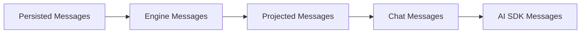

# Engine Messages And Projections

## 目标

为 runtime 建立稳定的内部消息管理方案，明确消息从存储到模型输入之间的分层边界。

当前推荐理解方式是五层：

`Persisted Message → EngineMessage → Projected Message → ChatMessage → AI SDK Message`

解决的核心问题：

- 持久化历史与模型上下文构建解耦
- API 传输模型与 engine 内部语义模型解耦
- compact / prune / handoff / resume 成为一等能力
- transcript、debug、model-context 共享同一份底层消息真相
- AI SDK 适配与上下文裁剪解耦

---

## 五层定义

| 层 | 职责 | 特点 |
| --- | --- | --- |
| **Persisted Messages** | 存储与 API 传输真相 | 稳定、通用、可持久化；不直接承担完整 runtime 语义 |
| **Engine Messages** | runtime 语义层 | 由 Persisted Message 提升得到；显式携带 `kind` |
| **Projected Messages** | 面向特定消费目标的视图 | 可过滤、裁剪、重排、补充 synthetic 消息 |
| **Chat Messages** | 通用模型输入格式 | role/content 结构，脱离 session/run 存储语义 |
| **AI SDK Messages** | 最终请求格式 | 满足 provider/SDK 格式要求，只负责最后一跳序列化 |

关系：

- `EngineMessage` 来源于 `Persisted Message`
- `ModelMessage` 是 `ProjectedMessage` 中面向模型的一种视图
- `ChatMessage` 是投影结果序列化后的通用输入格式
- AI SDK / provider message 是再下一层的适配结果



---

## 为什么需要分层

- 数据库存档需要稳定，runtime 语义需要可演进
- UI transcript 要完整过程，模型上下文必须裁剪
- compact 后需保留 summary artifact，同时可回看完整历史
- tool result 过长时，模型用 stub，调试界面看原文
- hook/system reminder/handoff summary 不适合与用户消息混为一体
- 不同 provider 的 content part 支持不同，消息模型不应与 SDK 结构绑死

---

## 运行时主链路

1. 读取持久化历史
2. 将 `Message` 提升为 `EngineMessage`
3. 应用 projection，得到 transcript / model / compact / debug 等视图
4. 将 model view 序列化为 `ChatMessage`
5. 适配为 AI SDK / provider message
6. 传给模型网关 / AI SDK

关键代码位置：

- 持久化消息定义：`packages/api-contracts/src/messages.ts`
- EngineMessage 提升：`packages/engine-core/src/engine/engine-messages.ts`
- 历史读取：`packages/engine-core/src/engine/session-history.ts`
- Projection：`packages/engine-core/src/engine/message-projections.ts`
- ChatMessage 序列化：`packages/engine-core/src/engine/ai-sdk-message-serializer.ts`
- 上下文构建：`packages/engine-core/src/engine-service.ts`
- Provider 适配：`packages/model-gateway/src/gateway-helpers.ts`

---

## 三个最容易混淆的核心类型

团队日常讨论里，最值得优先区分的是这三层：

- `Message`
- `EngineMessage`
- `ChatMessage`

### 1. Persisted Message

`Message` 定义在 `packages/api-contracts/src/messages.ts`，它是：

- 数据库存储层的原始会话消息
- `GET /sessions/:id/messages` 这类 API 返回值
- session 时间线的事实记录

它负责表达：

- 发生了什么
- 这条消息属于哪个 `session` / `run`
- 消息原始 `role` / `content` / `metadata`

它不负责直接表达：

- 这条消息在 engine 看来到底属于哪种 runtime 语义
- 这条消息最终是否应该进入模型上下文
- compact / pruning / projection 后的上下文窗口

一句话：`Message` 是存储与 API 层的 canonical fact model。

### 2. EngineMessage

`EngineMessage` 定义在 `packages/engine-core/src/engine/engine-messages.ts`，它是：

- engine 内部运行时语义层
- 由持久化 `Message` 推导 / 提升得到的对象
- projection 的统一输入

相比 `Message`，它新增的关键能力是：

- 显式的 `kind`
- 更适合 runtime 的 metadata 解释

例如持久化层只是一个 `role: "system"` 的消息；到了 `EngineMessage` 层，它才会被明确识别成：

- `compact_boundary`
- `compact_summary`
- `system_note`

一句话：`EngineMessage` 不是 `Message` 的简化版，而是对 `Message` 的 runtime 语义解释。

### 3. ChatMessage

`ChatMessage` 同样来自 `@oah/api-contracts`，但它不再是“会话存档消息”，而是：

- 面向模型输入的通用消息格式
- 更接近 provider request 的 role/content 结构
- 不再关心 `sessionId`、`runId`、`createdAt` 这类存储字段

它负责表达：

- 模型这一轮到底看到哪些消息
- 这些消息最终用什么 role/content 形式传给网关

一句话：`ChatMessage` 是模型输入层，不是存档层。

---

## 为什么 Persisted Message 不应该直接等于 EngineMessage

很多人第一次看会直觉觉得：

- `Message` 是不是就是 `EngineMessage` 的简化版？
- 能不能合并？

当前设计里，不建议这样理解。

更准确的边界是：

- `Message` 是原始事实
- `EngineMessage` 是 runtime 解释

这么分的原因：

- 持久化 / API 合同需要稳定
- engine 内部语义需要可演进
- projection 需要面向运行时语义工作，而不是直接读存储模型
- compact / resume / handoff 这类能力会持续增加内部语义类型

如果把两者合并：

- 持久化合同会被 runtime 内部语义污染
- API 返回会暴露过多 engine 内部概念
- `kind` 的演进会变成存储迁移问题
- 外部调用方会被迫理解内部执行语义

所以推荐方式是：

- `Message` 保持轻量稳定
- `metadata.runtimeKind` 作为持久化到 runtime 的桥
- `EngineMessage.kind` 作为内部语义标准

---

## 在当前实现里，Persisted Message 如何得到 EngineMessage

核心入口在：

- `packages/engine-core/src/engine/engine-messages.ts`

提升逻辑大致是：

1. 读取持久化 `Message`
2. 解析 `metadata`
3. 如果 `metadata.runtimeKind` 存在且合法，直接用它作为 `EngineMessage.kind`
4. 否则根据 `role + content` 推断

例如：

- `system` → `system_note`
- `user` → `user_input`
- `assistant` + `tool-call` part → `tool_call`
- `assistant` + `reasoning` part → `assistant_reasoning`
- `tool` → `tool_result`

compact 是典型例子：

- 落库时仍然是普通 `Message`
- 通过 `metadata.runtimeKind` 记录它是 `compact_boundary` 或 `compact_summary`
- engine 读取后再提升为对应的 `EngineMessage.kind`

---

## Projection Layer 的职责

Projection layer 不直接操作存储模型，而是尽量操作 `EngineMessage`。

原因是：

- `EngineMessage.kind` 已经表达了 runtime 语义
- 可以避免在多个地方反复猜 `metadata`
- compact / transcript / debug / model context 可以共享同一套语义输入

推荐原则：

- Projection 输入：`EngineMessage[]`
- Projection 逻辑：尽量依赖 `EngineMessage.kind`
- 持久化桥接：只在 `Message -> EngineMessage` 这一层读 `metadata.runtimeKind`

对 compact 来说，关键语义是：

- `compact_boundary` 负责切历史
- `compact_summary` 负责承接旧上下文

例如 `projectToModel()` 的语义是：

- 找最近的 `compact_boundary`
- boundary 本身不进模型
- 找关联的 `compact_summary`
- 把 summary 放到裁切后窗口最前面
- 再拼上 boundary 之后的 recent messages

---

## 当前实现里的五层对应关系

| 概念 | 当前实现中的主要类型 | 主要代码位置 |
| --- | --- | --- |
| Persisted Message | `Message` | `packages/api-contracts/src/messages.ts` |
| Runtime semantic message | `EngineMessage` | `packages/engine-core/src/engine/engine-messages.ts` |
| Projection result | `TranscriptMessage` / `ModelMessage` / `CompactMessage` / `DebugMessage` | `packages/engine-core/src/engine/message-projections.ts` |
| Provider-neutral model input | `ChatMessage` | `packages/engine-core/src/engine/ai-sdk-message-serializer.ts` |
| Provider/SDK input | AI SDK `ModelMessage` 等 | `packages/model-gateway/src/gateway-helpers.ts` |

---

## 与 Claude Code 的关系

Claude Code 的思路是同向的，但分层更隐式。

可以粗略对照为：

| OAH | Claude Code 中更接近的层 |
| --- | --- |
| `Message` | `Message` |
| `EngineMessage` | `NormalizedMessage` + 一部分消息语义工具函数 |
| Projection layer | `getMessagesAfterCompactBoundary()`、`normalizeMessagesForAPI()` 等消息处理链 |
| `ChatMessage` / provider input | 最终 API-bound messages |

参考位置：

- `normalizeMessages()`：`references/claude-code-source-code/src/utils/messages.ts`
- `normalizeMessagesForAPI()`：`references/claude-code-source-code/src/utils/messages.ts`
- `getMessagesAfterCompactBoundary()`：`references/claude-code-source-code/src/utils/messages.ts`
- `buildPostCompactMessages()`：`references/claude-code-source-code/src/services/compact/compact.ts`

结论：

- Claude Code 也不是“只有一层消息模型”
- 它同样把“会话消息”“规范化消息”“API 输入消息”分开处理
- OAH 单独抽出 `EngineMessage`，是更显式、更工程化的实现

---

## 一个更准确的心智模型

推荐团队内部统一使用下面这组表述：

- `Message`：数据库里的原始会话消息
- `EngineMessage`：engine 对原始消息的 runtime 解释
- `ProjectedMessage`：面向某个消费目标的投影视图
- `ChatMessage`：真正送往模型的一般化输入消息

最简记忆法：

- `Message` 记录事实
- `EngineMessage` 解释语义
- Projection 选择视图
- `ChatMessage` 进入模型

---

## Engine Messages 类型

```ts
export type EngineMessageRole = "system" | "user" | "assistant" | "tool";

export type EngineMessageKind =
  | "system_note"
  | "user_input"
  | "assistant_text"
  | "assistant_reasoning"
  | "tool_call"
  | "tool_result"
  | "tool_approval_request"
  | "tool_approval_response"
  | "compact_boundary"
  | "compact_summary"
  | "runtime_reminder"
  | "handoff_summary"
  | "agent_switch_note";

export interface EngineMessageBase {
  id: string;
  sessionId: string;
  runId?: string;
  role: EngineMessageRole;
  kind: EngineMessageKind;
  createdAt: string;
  metadata?: {
    agentName?: string;
    effectiveAgentName?: string;
    synthetic?: boolean;
    visibleInTranscript?: boolean;
    eligibleForModelContext?: boolean;
    compactedAt?: string;
    compactBoundaryId?: string;
    summaryForBoundaryId?: string;
    source?: "user" | "engine" | "hook" | "tool" | "system";
    tags?: string[];
    extra?: Record<string, unknown>;
  };
}
```

设计约束：

- `role` 对齐外部生态
- `kind` 表达 runtime 内部语义
- `compact_boundary` / `compact_summary` 必须显式建模，不用普通 system 文本冒充

### 分类

**一等类型（必须）：** `user_input`、`assistant_text`、`tool_call`、`tool_result`、`compact_boundary`、`compact_summary`

**逐步引入：** `assistant_reasoning`、`runtime_reminder`、`handoff_summary`、`agent_switch_note`

**继续用 metadata 表达：** 调试标签、审计附加字段、UI 提示性状态

经验：一旦某语义会被 projection / compact / resume 依赖，就应升级为明确 kind。

---

## Projected Messages 类型

```ts
export type ProjectionView =
  | "transcript" | "model" | "compact" | "debug" | "export";

export interface ProjectedMessageBase {
  view: ProjectionView;
  role: "system" | "user" | "assistant" | "tool";
  semanticType: string;
  sourceMessageIds: string[];
  content: unknown;
  metadata?: {
    hiddenFromTranscript?: boolean;
    hiddenFromModel?: boolean;
    truncated?: boolean;
    compacted?: boolean;
    notes?: string[];
  };
}
```

`sourceMessageIds` 用于 debug 反查来源、compact 诊断追踪、UI "展开原始消息"。

---

## Model Messages 类型

```ts
export interface ModelMessage extends ProjectedMessageBase {
  view: "model";
  semanticType:
    | "system_note" | "runtime_reminder" | "user_input"
    | "assistant_text" | "assistant_reasoning"
    | "tool_call" | "tool_result"
    | "compact_summary" | "handoff_summary";
  content: string | ModelMessagePart[];
}
```

保留 `semanticType` 和 `sourceMessageIds`，便于 runtime 调试和 provider 兼容。

---

## Projection Views

| View | 用途 | 特点 |
| --- | --- | --- |
| **Transcript** | 前端聊天窗口、CLI、历史页 | 保留完整过程，显示 compact boundary |
| **Model** | 构造模型输入上下文 | 应用 compact boundary、tool-result pruning、runtime reminder |
| **Compact** | 供 compact 逻辑自身使用 | 专注"哪些历史需要被总结" |
| **Debug** | 开发调试和问题排查 | 保留更多 metadata，标出被过滤/截断的消息 |
| **Export** | 导出对话、分享、生成 report | 去掉 runtime 噪声，允许脱敏 |

---

## Projection API

```ts
export interface ProjectionContext {
  sessionId: string;
  activeAgentName: string;
  modelRef?: string;
  provider?: string;
  includeReasoning?: boolean;
  includeToolResults?: boolean;
  toolResultSoftLimitChars?: number;
  applyCompactBoundary?: boolean;
  injectRuntimeReminder?: boolean;
}

export interface ProjectionResult<TMessage> {
  messages: TMessage[];
  diagnostics: {
    hiddenMessageIds: string[];
    truncatedMessageIds: string[];
    appliedCompactBoundaryId?: string;
    injectedNotes: string[];
  };
}

export interface EngineMessageProjector {
  projectToTranscript(msgs: EngineMessage[], ctx: ProjectionContext): ProjectionResult<TranscriptMessage>;
  projectToModel(msgs: EngineMessage[], ctx: ProjectionContext): ProjectionResult<ModelMessage>;
  projectToDebug(msgs: EngineMessage[], ctx: ProjectionContext): ProjectionResult<DebugMessage>;
  projectToCompact(msgs: EngineMessage[], ctx: ProjectionContext): ProjectionResult<CompactMessage>;
}
```

---

## projectToModel() 规则

### 基础

1. 仅保留 `eligibleForModelContext !== false` 的消息
2. 启用 compact 时，只取最近 `compact_boundary` 之后的窗口
3. `compact_boundary` 本身不进入 model view
4. `compact_summary` 进入 model view
5. `runtime_reminder` 可按策略注入

### Tool 相关

- `tool_call` 默认保留
- `tool_result` 标记 `compactedAt` 时降级为 stub
- 超长 `tool_result` 在 projection 层截断
- provider 不支持某类附件时降级为文本提示

### Agent / Handoff

- `handoff_summary` 默认进入 model view
- `agent_switch_note` 默认不发给模型（除非承担 system reminder 语义）

### 最小 compact 规则

1. 找到最近 `compact_boundary`
2. 若有 `compact_summary`，作为压缩上下文起点
3. 保留 boundary 之后的 recent messages
4. 更老的长 `tool_result` 仅保留 stub

## Compact 触发窗口优先级

compact 是否触发，首先要先得到当前模型的上下文窗口大小。这里采用两级优先级：

1. 优先使用模型 API `/v1/models` 返回的 `max_model_len`
2. 若没有该值，再回退到模型 metadata 中配置的 `contextWindowTokens`

如果两者都缺失，runtime 会保留完整 Engine Messages，不执行基于 context window 的自动 compact。

---

## Prompt 选择与 AI SDK 序列化边界

- `projectToModel()` 决定"给模型看什么"
- `toAiSdkMessages()` 决定"按 SDK 要求怎么表示"

不要把裁剪逻辑塞进 serializer。

被 prune 的 tool result 示例：

```ts
// Engine Message
{ kind: "tool_result", metadata: { compactedAt: "2026-04-08T10:00:00Z" } }

// Model projection
{ view: "model", semanticType: "tool_result",
  content: [{ type: "tool-result", toolCallId: "call_1",
    output: { type: "text", value: "[Old tool result content cleared]" } }] }
```

Serializer 再将其转为 AI SDK payload。

---

## AI SDK Adapter

```ts
export interface ModelMessageSerializer {
  toAiSdkMessages(
    messages: ModelMessage[],
    options?: { workspace?: WorkspaceRecord }
  ): Promise<ChatMessage[]>;
}
```

只负责：role/content 格式转换、system message 合并、provider 兼容、非法组合兜底。不负责 compact 决策或裁剪。

---

## Compact 设计

引入 Engine Messages 后，compact 升级为 message artifact：

- `compact_boundary` — 标记上下文边界
- `compact_summary` — 边界前历史的总结

效果：transcript view 看完整历史 + compact 事件，model view 从最近 boundary 后构建上下文，debug view 显示 compact 作用范围。

## Tool-Result Pruning

原则：存储层保留原始结果，model view 降级为 stub，transcript view 显示完整值或懒加载，debug view 标出已 compacted。

最小实现：`EngineMessage.metadata.compactedAt` + projector 输出统一 stub。

---

## 模块划分

`packages/engine-core/src/engine/` 下新增：

| 文件 | 职责 |
| --- | --- |
| `engine-messages.ts` | Engine Message 类型 + 从持久化 Message 归一化 |
| `projections/types.ts` | Projected / Model / Transcript / Debug 消息类型 |
| `projections/projector.ts` | `EngineMessageProjector` 实现 |
| `ai-sdk-adapter.ts` | `ModelMessageSerializer` |

现有模块调整：

- `session-history.ts` — 历史读取、修复、转 Engine Messages
- `engine-service.ts` — orchestration，不直接承担 projection
- `execution-message-content.ts` — 底层 content 工具，逐步收缩直接拼模型消息的职责

---

## 贯穿示例

用户输入："帮我看看 src/auth.ts 为什么登录失败，并修一下。" 模型调用 `Read(src/auth.ts)`。

### Engine Messages

```ts
[
  { id: "m1", kind: "system_note", role: "system", content: "Workspace root is /repo" },
  { id: "m2", kind: "user_input", role: "user", content: "帮我看看 src/auth.ts ..." },
  { id: "m3", kind: "tool_call", role: "assistant",
    content: [{ type: "tool-call", toolCallId: "call_1", toolName: "Read", input: { file_path: "src/auth.ts" } }] },
  { id: "m4", kind: "tool_result", role: "tool", metadata: { compactedAt: "2026-04-08T10:00:00Z" },
    content: [{ type: "tool-result", toolCallId: "call_1", output: { type: "text", value: "...长文件..." } }] },
  { id: "m5", kind: "assistant_text", role: "assistant", content: "我先定位问题，再修改登录逻辑。" }
]
```

### Model Messages (after projectToModel)

```ts
[
  { view: "model", role: "system", semanticType: "system_note", sourceMessageIds: ["m1"], content: "Workspace root is /repo" },
  { view: "model", role: "user", semanticType: "user_input", sourceMessageIds: ["m2"], content: "帮我看看 src/auth.ts ..." },
  { view: "model", role: "assistant", semanticType: "tool_call", sourceMessageIds: ["m3"],
    content: [{ type: "tool-call", toolCallId: "call_1", toolName: "Read", input: { file_path: "src/auth.ts" } }] },
  { view: "model", role: "tool", semanticType: "tool_result", sourceMessageIds: ["m4"],
    metadata: { compacted: true },
    content: [{ type: "tool-result", toolCallId: "call_1", output: { type: "text", value: "[Old tool result content cleared]" } }] },
  { view: "model", role: "assistant", semanticType: "assistant_text", sourceMessageIds: ["m5"],
    content: "我先定位问题，再修改登录逻辑。" }
]
```

### AI SDK Messages

```ts
[
  { role: "system", content: "Workspace root is /repo" },
  { role: "user", content: "帮我看看 src/auth.ts ..." },
  { role: "assistant", content: [{ type: "tool-call", toolCallId: "call_1", toolName: "Read", input: { file_path: "src/auth.ts" } }] },
  { role: "tool", content: [{ type: "tool-result", toolCallId: "call_1", output: { type: "text", value: "[Old tool result content cleared]" } }] },
  { role: "assistant", content: "我先定位问题，再修改登录逻辑。" }
]
```

---

## 迁移顺序

| Phase | 内容 |
| --- | --- |
| 1 | 引入 `EngineMessage` + `projectToModel()` 最小版本，不改外部 API 和持久化表 |
| 2 | 引入 compact artifacts（`compact_boundary` / `compact_summary`） |
| 3 | 引入 tool-result pruning（`compactedAt` + model stub） |
| 4 | 扩展 export / search / analytics 视图 |

## 非目标

当前不要求实现：session memory consolidation、reactive compact retry、context collapse、provider 专属 prompt cache 优化。
