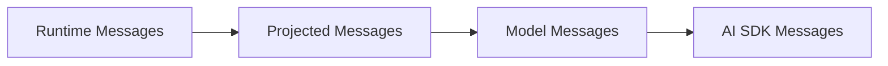

# Runtime Messages And Projections

## 目标

为 runtime 建立一套稳定的内部消息管理方案，并明确以下分层：

`Runtime Messages -> Projected Messages -> Model Messages -> AI SDK Messages`

这套分层用于解决几个长期问题：

- session 持久化历史与模型上下文构建解耦
- compact / prune / handoff / resume 成为一等 runtime 能力
- transcript、debug、model-context 等不同消费方共享同一份底层消息真相
- AI SDK 适配逻辑与上下文裁剪逻辑解耦

---

## 命名

### Runtime Messages

运行时内部统一消息模型，保存真实历史。

特点：

- 是 runtime 内部事实来源
- 用于持久化、恢复、审计、projection
- 允许携带 runtime-only metadata
- 不要求直接兼容 AI SDK

### Projected Messages

从 `Runtime Messages` 投影出的不同视图总称。

特点：

- 面向特定消费目标
- 可以过滤、裁剪、重排、补充 synthetic 消息
- 不同 view 共享同一份底层 `Runtime Messages`

### Model Messages

`Projected Messages` 的一种，专门用于表示“这一轮准备给模型看的消息语义”。

特点：

- 已经完成上下文选择和裁剪
- 仍保留 runtime 语义，不直接等于 AI SDK request payload
- 是 `projectToModel()` 的产物

### AI SDK Messages

最终发送给 AI SDK 的消息结构。

特点：

- 满足 provider / SDK 对 role 和 content 的格式要求
- 不再决定“看什么”
- 只负责“怎么表示”

---

## 为什么需要分层

如果只保留一份“可直接发给模型”的 message 列表，后续会遇到几个典型问题：

- UI transcript 想保留完整过程，但模型上下文必须裁剪
- compact 后需要保留 summary artifact，同时仍能回看完整历史
- tool result 很长时，希望对模型做 stub，但调试界面仍能看到原文
- hook、system reminder、handoff summary 是 runtime 生成的内容，不适合和用户原始消息混为一体
- 不同 provider 支持的 content part 不同，若消息模型和 SDK 结构绑死，后续兼容成本会不断上升

因此：

- `Runtime Messages` 负责保存真相
- `Projected Messages` 负责生成不同视图
- `Model Messages` 负责表达模型上下文语义
- `AI SDK Messages` 负责最终序列化

---

## 关系图



更具体地说：

- `Transcript Messages` 是一种 `Projected Messages`
- `Debug Messages` 是一种 `Projected Messages`
- `Compact Messages` 是一种 `Projected Messages`
- `Model Messages` 也是一种 `Projected Messages`

即：

`Model Messages ⊂ Projected Messages`

---

## 运行时主链路中的位置

建议 runtime 的上下文构建流程改为：

1. 读取持久化 message 历史
2. 归一化为 `Runtime Messages`
3. 对 `Runtime Messages` 应用 projection，得到 `Model Messages`
4. 将 `Model Messages` 序列化为 `AI SDK Messages`
5. 传给模型网关或 AI SDK

对应现有代码中的关键接入点：

- 历史读取与修复：
  `packages/runtime-core/src/runtime/session-history.ts`
- 上下文构建入口：
  `packages/runtime-core/src/runtime-service.ts`
- 当前直接做 content 转换的位置：
  `packages/runtime-core/src/runtime-message-content.ts`

长期目标是让 `runtime-service.ts` 不再直接基于持久化 `Message[]` 拼模型输入，而是：

- 先产出 `Runtime Messages`
- 再调用 projector 生成 `Model Messages`
- 最后调用 serializer 产出 `AI SDK Messages`

---

## Runtime Messages 草案

建议新增 runtime 内部消息类型，而不是直接把 API `Message` 视为最终内部模型。

```ts
export type RuntimeMessageRole = "system" | "user" | "assistant" | "tool";

export type RuntimeMessageKind =
  | "system_note"
  | "user_input"
  | "assistant_text"
  | "assistant_reasoning"
  | "tool_call"
  | "tool_result"
  | "tool_approval_request"
  | "tool_approval_response"
  | "compact_boundary"
  | "compact_summary"
  | "runtime_reminder"
  | "handoff_summary"
  | "agent_switch_note";

export interface RuntimeMessageBase {
  id: string;
  sessionId: string;
  runId?: string;
  role: RuntimeMessageRole;
  kind: RuntimeMessageKind;
  createdAt: string;
  metadata?: {
    agentName?: string;
    effectiveAgentName?: string;
    synthetic?: boolean;
    visibleInTranscript?: boolean;
    eligibleForModelContext?: boolean;
    compactedAt?: string;
    compactBoundaryId?: string;
    summaryForBoundaryId?: string;
    source?: "user" | "runtime" | "hook" | "tool" | "system";
    tags?: string[];
    extra?: Record<string, unknown>;
  };
}
```

### 设计约束

- `role` 保持与外部生态一致，降低理解成本
- `kind` 表达 runtime 内部语义
- `metadata` 允许保存 runtime-only 信息
- `compact_boundary` 和 `compact_summary` 必须显式建模，不建议只用普通 system 文本冒充

### 为什么不直接使用 API Message

当前 API `Message` 更偏外部传输与存储兼容结构：

- 它适合作为公开 contract
- 但不适合作为长期的 runtime 真相模型

原因是 runtime 需要表达更多内部语义，例如：

- 是否 synthetic
- 是否只在 transcript 中可见
- 是否已经被 compact / prune
- 该 summary 关联哪个 compact boundary
- 该 message 是否可参与 model context

这些语义不应全部压进现有 API `Message` 的 `metadata` 并在业务各处散落判断。

---

## Runtime Message 分类建议

### 必须是一等类型的消息

- `user_input`
- `assistant_text`
- `tool_call`
- `tool_result`
- `compact_boundary`
- `compact_summary`

### 建议逐步引入的一等类型

- `assistant_reasoning`
- `runtime_reminder`
- `handoff_summary`
- `agent_switch_note`

### 可以继续沿用 metadata 表达的内容

- 调试标签
- 审计附加字段
- UI 提示性状态

经验上，一旦某个语义会被：

- projection 依赖
- compact 依赖
- resume / handoff 依赖

就不应只放在松散 metadata 中，而应升级成明确 kind。

---

## Projected Messages 草案

Projected Message 是通用投影视图，重点是表达“某个 view 下这条消息长什么样”。

```ts
export type ProjectionView =
  | "transcript"
  | "model"
  | "compact"
  | "debug"
  | "export";

export interface ProjectedMessageBase {
  view: ProjectionView;
  role: "system" | "user" | "assistant" | "tool";
  semanticType: string;
  sourceMessageIds: string[];
  content: unknown;
  metadata?: {
    hiddenFromTranscript?: boolean;
    hiddenFromModel?: boolean;
    truncated?: boolean;
    compacted?: boolean;
    notes?: string[];
  };
}
```

`sourceMessageIds` 很重要，因为它允许：

- debug view 反查这条 projection 来自哪些 runtime messages
- compact / prune 诊断时给出可追踪来源
- UI 或审计面板做“展开原始消息”

---

## Model Messages 草案

`Model Messages` 是 `Projected Messages` 的子集，代表“模型上下文语义层”。

```ts
export interface ModelMessage extends ProjectedMessageBase {
  view: "model";
  role: "system" | "user" | "assistant" | "tool";
  semanticType:
    | "system_note"
    | "runtime_reminder"
    | "user_input"
    | "assistant_text"
    | "assistant_reasoning"
    | "tool_call"
    | "tool_result"
    | "compact_summary"
    | "handoff_summary";
  content: string | ModelMessagePart[];
}
```

这一层故意不直接等于 AI SDK message，因为它还需要保留：

- `semanticType`
- `sourceMessageIds`
- projection metadata

这些信息对 runtime 调试和 provider 兼容都很有帮助。

---

## 建议先支持的 Projection Views

### 1. Transcript View

作用：

- 前端聊天窗口
- CLI transcript
- session 历史页

特点：

- 尽量保留完整过程
- 可以显示 compact boundary
- 可以显示“该内容已被压缩”提示
- 不要求与模型当前上下文完全一致

### 2. Model View

作用：

- 构造模型输入上下文

特点：

- 应用 compact boundary
- 应用 tool-result pruning
- 插入 runtime reminder
- 过滤内部不可见消息

### 3. Compact View

作用：

- 供 compact 逻辑自己使用

特点：

- 专注“哪些历史需要被总结”
- 允许保留 recent messages verbatim
- 允许裁掉大媒体和过长 tool outputs

### 4. Debug View

作用：

- 开发调试
- 线上问题排查

特点：

- 保留更多 metadata
- 标出哪些消息在 model view 中被过滤或截断
- 支持追踪 projection 来源

### 5. Export View

作用：

- 导出对话
- 分享链接
- 生成 issue / PR / report

特点：

- 去掉 runtime-only 噪声
- 可按需要折叠 tool 过程
- 允许脱敏

---

## Projection API 草案

建议将 projection 抽成独立 service，不把规则散在 `runtime-service.ts` 中。

```ts
export interface ProjectionContext {
  sessionId: string;
  activeAgentName: string;
  modelRef?: string;
  provider?: string;
  includeReasoning?: boolean;
  includeToolResults?: boolean;
  toolResultSoftLimitChars?: number;
  applyCompactBoundary?: boolean;
  injectRuntimeReminder?: boolean;
}

export interface ProjectionResult<TMessage> {
  messages: TMessage[];
  diagnostics: {
    hiddenMessageIds: string[];
    truncatedMessageIds: string[];
    appliedCompactBoundaryId?: string;
    injectedNotes: string[];
  };
}

export interface RuntimeMessageProjector {
  projectToTranscript(
    runtimeMessages: RuntimeMessage[],
    context: ProjectionContext
  ): ProjectionResult<TranscriptMessage>;

  projectToModel(
    runtimeMessages: RuntimeMessage[],
    context: ProjectionContext
  ): ProjectionResult<ModelMessage>;

  projectToDebug(
    runtimeMessages: RuntimeMessage[],
    context: ProjectionContext
  ): ProjectionResult<DebugMessage>;

  projectToCompact(
    runtimeMessages: RuntimeMessage[],
    context: ProjectionContext
  ): ProjectionResult<CompactMessage>;
}
```

---

## projectToModel() 规则草案

### 基础规则

1. 仅保留 `eligibleForModelContext !== false` 的消息
2. 若启用 compact，则只取最近一次 `compact_boundary` 之后的有效窗口
3. `compact_boundary` 本身默认不直接进入 model view
4. `compact_summary` 默认进入 model view
5. `runtime_reminder` 可按策略注入

### Tool 相关规则

1. `tool_call` 默认保留
2. `tool_result` 若被标记 `compactedAt`，则降级成 stub
3. `tool_result` 若输出超长，可在 projection 层截断或替换为简短说明
4. provider 不支持某类附件时，应在 model view 或 AI SDK adapter 中降级为文本提示

### Agent / Handoff 相关规则

1. `handoff_summary` 默认可进入 model view
2. `agent_switch_note` 默认不直接发给模型，除非它承担 system reminder 语义
3. 同一 run 内连续无意义 system note 不应无界累积

### 推荐的最小 compact 规则

1. 找到最近一次 `compact_boundary`
2. 如果之后有 `compact_summary`，将其作为压缩上下文起点
3. 保留 boundary 之后的 recent user / assistant / tool messages
4. 对更老的长 `tool_result` 仅保留 stub

---

## Prompt 选择和 AI SDK 序列化的边界

建议明确：

- `projectToModel()` 决定“给模型看什么”
- `toAiSdkMessages()` 决定“按 AI SDK 要求怎么表示”

不要把上下文裁剪逻辑塞进 serializer。

### 例子

一个被 prune 的 tool result：

```ts
// Runtime Message
{
  kind: "tool_result",
  role: "tool",
  metadata: { compactedAt: "2026-04-08T10:00:00Z" },
  ...
}
```

在 model projection 中变成：

```ts
{
  view: "model",
  role: "tool",
  semanticType: "tool_result",
  content: [
    {
      type: "tool-result",
      toolCallId: "call_1",
      toolName: "Read",
      output: { type: "text", value: "[Old tool result content cleared]" }
    }
  ]
}
```

最后 serializer 才把它输出成 AI SDK 可接受的 payload。

---

## AI SDK Adapter 草案

建议增加一层 serializer：

```ts
export interface ModelMessageSerializer {
  toAiSdkMessages(messages: ModelMessage[]): ChatMessage[];
}
```

这一层建议只负责：

- role / content 格式转换
- system message 合并
- provider 能力兼容
- 非法组合兜底

不负责：

- compact 决策
- 裁剪哪些历史
- 选择哪些 tool result 保留

---

## 对 compact 的影响

引入 Runtime Messages 与 Projection Layer 后，compact 应该升级为 message artifact，而不是“数组截断”。

建议新增的一等消息：

- `compact_boundary`
- `compact_summary`

含义：

- `compact_boundary` 标记一个新的上下文边界
- `compact_summary` 表示边界前历史的总结结果

之后：

- transcript view 仍可看到完整历史和 compact 事件
- model view 只从最近 boundary 之后构造有效上下文
- debug view 可以显示 compact 应用了哪些原始消息

这比单纯删老消息更可追踪，也更适合后续 resume / export / audit。

---

## 对 tool-result pruning 的影响

建议把 tool-result pruning 设计成 projection-time 优先。

### 原则

- 存储层尽量保留原始结果
- model view 中允许降级为 stub
- transcript view 仍可显示完整值或懒加载原值
- debug view 应标出该消息在 model view 中已被 compacted

### 推荐最小实现

1. 为 `RuntimeMessage.metadata.compactedAt` 增加语义
2. projector 看到该字段时，在 model view 输出统一 stub
3. transcript view 可显示“该结果已从模型上下文移除”

这比一开始就改写底层存储更安全。

---

## 模块划分建议

建议在 `packages/runtime-core/src/runtime/` 下新增：

- `runtime-messages.ts`
  - Runtime Message 类型定义
  - 从持久化 `Message` 映射到 `RuntimeMessage` 的归一化逻辑
- `projections/types.ts`
  - Projected / Model / Transcript / Debug 消息类型
- `projections/projector.ts`
  - `RuntimeMessageProjector` 实现
- `ai-sdk-adapter.ts`
  - `ModelMessageSerializer`

现有模块建议分工调整为：

- `session-history.ts`
  - 历史读取、修复、转 Runtime Messages 的入口
- `runtime-service.ts`
  - orchestration，不直接承担 projection 细节
- `runtime-message-content.ts`
  - 保留底层 content 构造工具，逐步收缩直接拼模型消息的职责

---

## 贯穿例子

下面用一个完整例子说明四层之间的关系。

用户输入：

`帮我看看 src/auth.ts 为什么登录失败，并修一下。`

模型先调用 `Read(src/auth.ts)`，然后准备继续分析。

### Runtime Messages

```ts
[
  {
    id: "m1",
    kind: "system_note",
    role: "system",
    content: "Workspace root is /repo"
  },
  {
    id: "m2",
    kind: "user_input",
    role: "user",
    content: "帮我看看 src/auth.ts 为什么登录失败，并修一下。"
  },
  {
    id: "m3",
    kind: "tool_call",
    role: "assistant",
    content: [
      {
        type: "tool-call",
        toolCallId: "call_1",
        toolName: "Read",
        input: { file_path: "src/auth.ts" }
      }
    ]
  },
  {
    id: "m4",
    kind: "tool_result",
    role: "tool",
    metadata: {
      compactedAt: "2026-04-08T10:00:00Z"
    },
    content: [
      {
        type: "tool-result",
        toolCallId: "call_1",
        toolName: "Read",
        output: {
          type: "text",
          value: "...很长很长的文件内容..."
        }
      }
    ]
  },
  {
    id: "m5",
    kind: "assistant_text",
    role: "assistant",
    content: "我先定位问题，再修改登录逻辑。"
  }
]
```

这层保存的是运行时真相，不关心最终 AI SDK payload 长什么样。

### Model Messages

经过 `projectToModel()` 后：

```ts
[
  {
    view: "model",
    role: "system",
    semanticType: "system_note",
    sourceMessageIds: ["m1"],
    content: "Workspace root is /repo"
  },
  {
    view: "model",
    role: "user",
    semanticType: "user_input",
    sourceMessageIds: ["m2"],
    content: "帮我看看 src/auth.ts 为什么登录失败，并修一下。"
  },
  {
    view: "model",
    role: "assistant",
    semanticType: "tool_call",
    sourceMessageIds: ["m3"],
    content: [
      {
        type: "tool-call",
        toolCallId: "call_1",
        toolName: "Read",
        input: { file_path: "src/auth.ts" }
      }
    ]
  },
  {
    view: "model",
    role: "tool",
    semanticType: "tool_result",
    sourceMessageIds: ["m4"],
    metadata: {
      compacted: true,
      notes: ["tool result compacted for model context"]
    },
    content: [
      {
        type: "tool-result",
        toolCallId: "call_1",
        toolName: "Read",
        output: {
          type: "text",
          value: "[Old tool result content cleared]"
        }
      }
    ]
  },
  {
    view: "model",
    role: "assistant",
    semanticType: "assistant_text",
    sourceMessageIds: ["m5"],
    content: "我先定位问题，再修改登录逻辑。"
  }
]
```

这一层已经完成了上下文决策：

- 该保留什么
- 哪些内容要 stub
- 哪些消息来源于哪些 runtime messages

### AI SDK Messages

最后 serializer 将 `Model Messages` 转成 AI SDK 兼容结构：

```ts
[
  {
    role: "system",
    content: "Workspace root is /repo"
  },
  {
    role: "user",
    content: "帮我看看 src/auth.ts 为什么登录失败，并修一下。"
  },
  {
    role: "assistant",
    content: [
      {
        type: "tool-call",
        toolCallId: "call_1",
        toolName: "Read",
        input: { file_path: "src/auth.ts" }
      }
    ]
  },
  {
    role: "tool",
    content: [
      {
        type: "tool-result",
        toolCallId: "call_1",
        toolName: "Read",
        output: {
          type: "text",
          value: "[Old tool result content cleared]"
        }
      }
    ]
  },
  {
    role: "assistant",
    content: "我先定位问题，再修改登录逻辑。"
  }
]
```

这一步只负责格式兼容，不再决定上下文裁剪策略。

---

## 迁移顺序建议

### Phase 1

先引入 `RuntimeMessage` 和 `projectToModel()` 的最小版本。

目标：

- 不改外部 API
- 不改持久化表结构
- 先在 runtime 内部建立清晰边界

### Phase 2

引入 compact artifacts：

- `compact_boundary`
- `compact_summary`

并让 model projection 应用这些 artifacts。

### Phase 3

引入 tool-result pruning：

- `compactedAt`
- model stub
- debug / transcript 差异视图

### Phase 4

扩展其他视图：

- export
- search / index
- analytics

---

## 非目标

当前文档不要求立即实现：

- session memory consolidation
- reactive compact retry
- context collapse
- provider 专属 prompt cache 优化

这些都属于后续优化层，而不是本方案的最小骨架。

---

## 当前结论

长期应将 runtime 内部消息系统明确收敛为：

- `Runtime Messages` 保存真相
- `Projected Messages` 生成不同视图
- `Model Messages` 表达模型上下文语义
- `AI SDK Messages` 表达最终请求格式

这会成为后续 compact、resume、handoff、debug、audit 和 UI transcript 的共同基础。
