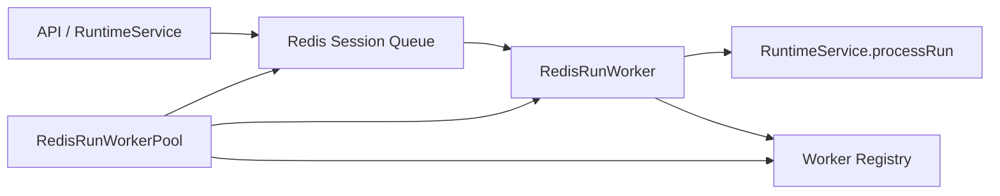

# Worker Control Plane

本文描述当前 Redis worker 调度、恢复与运维控制面的真实状态。它对应当前代码基线的“V1.5”阶段能力：本地弹性池、全局负载感知、stale run 自动恢复。

## 1. 目标

当前 worker 控制面的目标不是做一个完全中心化的调度系统，而是优先解决三件事：

- 单实例默认可用：`server` 自带 embedded worker，开箱即用
- 多实例可扩展：接入 Redis 后，多个 API / worker 进程可以共享同一套 session run queue
- 故障可恢复：worker 异常退出后，stale run 能自动回收或重新排队，而不是永久卡住

随着路线图进入 Phase 3，当前代码基线还新增了一层 workspace materialization 基础能力：

- 可把 `s3://bucket/prefix` 类型的 workspace 外部引用 materialize 到 worker 本地缓存目录
- 同一 worker 进程内对同一 `workspace + version` 的并发请求会复用同一份本地副本
- 本地副本具备 `dirty`、idle flush、idle eviction 和 close flush 语义
- queued run 当前已经会通过 execution workspace lease 使用 materialized 本地副本执行
- API 文件变更路径当前也已经会通过 workspace file access lease 写入 materialized 本地副本
- API 文件读取、content 查看和 download 当前也已经会通过 workspace file access lease 读取本地副本
- Redis workspace lease registry 当前已经会记录 `workspaceId + version + ownerWorkerId + ownerBaseUrl` 的 ownership lease，并随 materialization 生命周期续租/释放
- API 文件入口当前会先查询 ownership lease；如果 workspace 由其他 worker 持有且 lease 带有 `ownerBaseUrl`，会直接走 internal proxy 到 owner worker
- 当 ownership 真值存在但 owner 暂时不可达时，API 文件入口会回退为带 routing hint 的 `409 workspace_owned_by_another_worker`
- queued run 的 execution lease 当前会按 materialized 本地目录 fingerprint 判定真实 dirty，避免长期维持“project run 一律 dirty”的保守 flush
- standalone worker 当前已具备 internal-only HTTP 面，只暴露健康探针与 internal routes，供 split 部署下的 owner worker 文件转发使用

随着路线图进入 Phase 5，仓库里还新增了独立的 `worker-controller` 控制面入口：

- controller 当前从 Redis queue pressure 与 worker registry 读取 backlog / busy slot / ready age 等信号
- standalone worker lease 现在会额外发布 `runtimeInstanceId`，让 controller 能把同一 Pod 内多个 slot 正确聚合为一个 replica
- controller 当前会输出 `suggestedReplicas`、`desiredReplicas`、pressure streak、cooldown remaining 和 scale reason
- controller 当前已经具备可插拔 `scale target` 抽象，并已支持 Kubernetes `Deployment /scale` 子资源 reconcile
- 第一版 target 默认仍保持 `allow_scale_down = false`，先把自动扩容打通，再把自动缩容显式挂到 drain / graceful shutdown 完成度上
- 当前仍没有 leader election，也还缺少与 deployment / RBAC 清单的一体化交付；这一层仍处于“先把决策和执行接口接通，再补生产护栏”的阶段

## 2. 组件关系

职责划分：

- `RuntimeService` 负责创建 run、更新状态、恢复 stale run
- `RedisSessionRunQueue` 负责 ready queue、session queue 和 session lock
- `RedisRunWorker` 负责 claim session、获取锁、执行 run、续租 lease
- `RedisRunWorkerPool` 负责本地 worker 数量管理
- `WorkerRegistry` 负责发布和观测全局 worker lease

## 3. Worker 生命周期

单个 worker 的生命周期是：

1. `starting`
2. 发布 lease
3. 执行一次 stale run 恢复
4. 进入 `idle`
5. claim session 成功后切换到 `busy`
6. run 完成或放弃后回到 `idle`
7. 关闭时切换到 `stopping`

关键点：

- lease TTL 基于 lock TTL 和 poll timeout 计算
- worker 周期性刷新 lease，registry 用它判断 worker 是否健康
- worker 是“执行循环”的概念，不等同于 OS 线程；一个 Node 进程可以运行多个 embedded worker
- 当 worker 正在处理 run 时，slot / lease 还会额外暴露当前 `session`、`run`、`workspace` 上下文，便于后续接 workspace affinity 与 sticky dispatch
- 当前还额外提供了一个纯读模型的 worker affinity summary，用来按 `owner worker / same session / same workspace / idle capacity / health` 排序候选 worker；它先服务于观测和后续路由，不直接改写当前 queue claim 语义

## 4. 队列语义

当前不是“一个 run 一个全局队列项”，而是“两层模型”：

- `ready queue`：记录哪些 session 现在值得调度
- `session queue`：记录该 session 下待执行的 run

这样做的好处：

- 天然保证同 session 串行
- 跨 session 可以并行
- 抢不到锁时只需要把 session 重新放回 ready queue，不会破坏 run 顺序

## 5. 调度指标

当前 pool snapshot 暴露的指标可分为四类。

### 本地容量

- `minWorkers`
- `maxWorkers`
- `suggestedWorkers`
- `reservedSubagentCapacity`
- `reservedWorkers`
- `availableIdleCapacity`
- `readySessionsPerActiveWorker`
- `subagentReserveTarget`
- `subagentReserveDeficit`
- `desiredWorkers`
- `slotCapacity`
- `busySlots`
- `idleSlots`
- `activeWorkers`
- `busyWorkers`
- `idleWorkers`

### 队列压力

- `readySessionCount`
- `readyQueueDepth`
- `uniqueReadySessionCount`
- `subagentReadySessionCount`
- `subagentReadyQueueDepth`
- `lockedReadySessionCount`
- `staleReadySessionCount`
- `oldestSchedulableReadyAgeMs`

### 全局负载

- `globalSuggestedWorkers`
- `globalActiveWorkers`
- `globalBusyWorkers`
- `remoteActiveWorkers`
- `remoteBusyWorkers`

### 决策稳定性

- `scaleUpPressureStreak`
- `scaleDownPressureStreak`
- `scaleUpCooldownRemainingMs`
- `scaleDownCooldownRemainingMs`
- `recentDecisions`
- `lastRebalanceReason`

这些指标已经接入 Storage 页面的 Redis 面板，便于直接观察本地与全局 worker 负载。

补充说明：

- 当前实现里本地 `execution slot` 与 pool 内 worker 实例一一对应
- 因此 `activeWorkers` 仍可视作当前本地 slot 数，但后续路线图会优先以 slot 语义继续推进

## 6. 扩缩容策略

当前扩缩容不是简单按 ready queue 长度线性放大，而是结合以下三种压力：

### 6.1 队列压力

根据可调度 session 数计算理论 worker 需求：

`ceil(readySessionCount / readySessionsPerWorker)`

### 6.2 饱和压力

当已有 worker 很忙时，即使 ready session 数不大，也可能需要扩容：

`ceil((readySessionCount + busyWorkers) / readySessionsPerWorker)`

### 6.3 SubAgent 保底容量

当出现 subagent backlog 时，pool 会额外保证最小空闲容量：

`busyWorkers + reservedSubagentCapacity`

这让父 run 同步等待 child run 时，不会被普通 backlog 完全挤占。

### 6.4 老化压力

当下面两个条件同时满足时，额外建议增加一个 worker：

- busy ratio 达到阈值
- 最老可调度 session 等待时间超过阈值

这用于处理“ready session 不多，但已经有人排队太久”的情况。

### 6.5 去抖与日志

为避免频繁抖动，pool 还带有：

- scale up / down sample size
- scale up / down cooldown
- startup 直接对齐建议容量
- recent decisions 去重
- rebalance 日志只在容量或决策状态变化时输出

## 7. Stale Run 恢复

worker 启动时会扫描 heartbeat 超时的 active run，并按策略处理。

### 支持的恢复模式

| 策略 | `running` | `waiting_tool` |
| --- | --- | --- |
| `fail` | 标记失败 | 标记失败 |
| `requeue_running` | 重新排队 | 标记失败 |
| `requeue_all` | 重新排队 | 重新排队 |

### 重新排队的保护措施

- 必须存在 `runQueue`
- 必须仍有关联 `sessionId`
- 会记录 `recoveryAttempts`
- 超过 `maxAttempts` 后不再重排队
- 重排队前会清理运行中状态字段，避免把旧 heartbeat 带入新一轮调度

### 当前边界

- 这是“重新从 queued 开始执行”，不是从中间步骤断点续跑
- `waiting_tool` 续跑仍可能遇到外部副作用重复执行，因此默认不自动启用
- 超过恢复次数或保守策略拦截的 run 会进入 quarantine 元数据态，并保留人工 `manual requeue` 入口
- 管理面已支持对当前筛选结果做批量 `manual requeue`，并返回逐项成功/失败结果
- Storage 管理面已支持 `status` / `errorCode` / `recoveryState` 三个 runs 专用筛选，便于锁定 `worker_recovery_failed` 与 quarantine run
- Storage 概览已汇总 recovery 审计指标，可直接查看 quarantine 规模、最近隔离时间与 top reasons
- 目前仍没有独立 dead-letter queue，quarantine run 仍留在主 runs 表中

## 8. 运维建议

出现队列堆积时，优先看这几组信号：

- `readySessionCount` 是否持续高于 `activeWorkers`
- `busyWorkers / activeWorkers` 是否长期接近 1
- `oldestSchedulableReadyAgeMs` 是否持续增长
- `remoteActiveWorkers` 是否已经覆盖了全局需求，避免误判本机必须继续扩容
- `staleReadySessionCount` 是否升高，提示 ready queue 中有脏数据或锁竞争残留

如果 stale run 恢复异常，优先看：

- run `metadata.recoveryAttempts` 与 `metadata.recovery`
- `run.queued` / `run.failed` session event
- `run.requeued` / `run.failed` system step
- worker registry 中实例是否频繁消失或重启

## 9. 商业成熟化路线

当前这一版已经覆盖了基础可用性、自动恢复和可观测性，但距离完整商业控制面还差三层：

### Phase 2

- 独立 dead-letter / quarantine 结构
- 批量恢复、批量清理与审计视图
- 管理面多条件检索与批量人工干预入口

### Phase 3

- workspace / tenant 配额
- admission control
- 公平调度与饥饿保护

### Phase 4

- central scheduler / scaler
- drain / cordon
- rolling restart safety
- 分区级 SLO 与自动化运维动作
